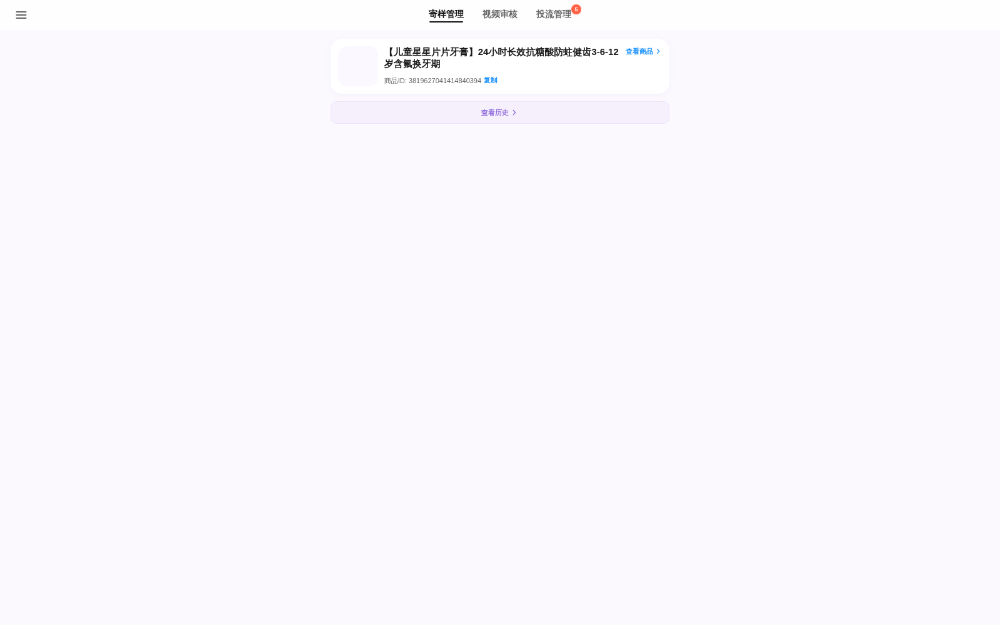
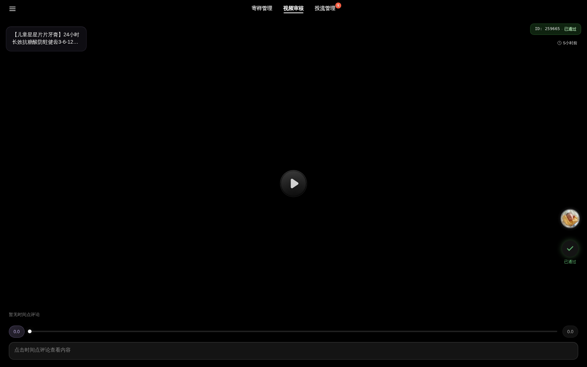
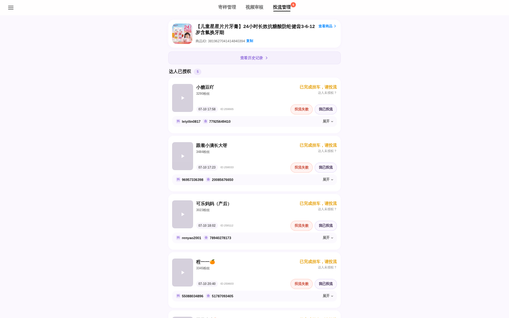

# 样例平台深度 Review:大狗文化「商家工作台」

> 样例地址:`https://gs.dagouwenhua.com/merchant_audits/9ccf4822?tab=video`
> Review 方式:真实渲染页面截图 + 前端代码(Vite 产物)逆向 + 后端 API 实际调用取数
> Review 日期:2026-07-10

## 0. 一句话结论

这是一个**按「商品」维度生成免登录短链**、发给商家使用的「达人合作审核工作台」,覆盖三条主流程:**寄样管理 → 视频审核 → 投流管理**。它做的是"商家侧的审批闭环",**不做**达人录入、达人分级、佣金管理、素材分发、卡审知识库——这些恰好是我们会议里客户最痛的点,也是我们系统的差异化空间。

---

## 1. 产品形态与技术架构

| 项 | 观察结果 |
|---|---|
| 入口 | `/merchant_audits/{short_code}`,short_code(如 `9ccf4822`)即访问凭证,**免登录**,可直接发微信群/朋友圈 |
| 组织维度 | 一条链接 = 一个商品(SKU)。样例商品:优伢宝贝儿童星星片片牙膏,佣金 5%,关联 96+ 达人、300 条视频记录 |
| 前端 | Vue 3 + Vite SPA,路由:`/merchant_audits/:short_code/feed`,三个 tab:`shipping` / `video` / `ads` |
| 后端 | 同域 `/api/*`,POST + `{token: short_code}` 取数;无鉴权头,token 即权限 |
| 附属系统 | 七牛云上传(拒绝截图)、xlsx 导入导出、`/docs/sample/{code}`、`/docs/traffic/{code}`「自定义文档系统」(寄样在线表格/投流在线表格) |
| 通讯录 | 数据里有 `conversationId: R:10835969891786662`,说明后台与聊天会话(企微/私有 IM)打通 |

主要 API(实测可用):

```
POST /api/merchant-data           # 寄样管理:商品 + 待处理达人申请(15条)
POST /api/merchant-history        # 寄样历史:173 条,approved/rejected 分类
POST /api/video-merchant-data     # 视频审核:300 条视频任务
POST /api/ads-history             # 投流历史:10 条已完成
POST /api/submit-merchant-audit   # 提交寄样审核
POST /api/submit-video-merchant-audit          # 提交视频审核
POST /api/request-expert-auth / confirm-expert-auth / remind-expert-promotion-auth  # 投流授权三件套
POST /api/product-merchant/temp-off-shelf / promotion-restore ...  # 商品临时下架/恢复
POST /api/export-merchant-data    # 导出发货清单 Excel
POST /api/qiniu-upload-token      # 图片上传
```

---

## 2. 三大模块拆解

### 2.1 寄样管理(tab=shipping)



- **待处理申请**:达人申请领样列表(姓名/手机/收货地址/抖音号/UID/sec_uid/粉丝数/近30天GMV/合作码),逐条或**批量**通过/拒绝。
- **预设拒绝理由**(沉淀了他们的寄样标准,值得抄):
  - 资质未达标,暂不寄样
  - 账号月销售额等级暂不符合寄样标准
  - 账号拍摄与视频质量暂不符合寄样标准
  - 账号仅支持桌拍,暂不符合口播类寄样要求
  - 账号已对接商家其他商务,请与原合作商务对接寄样事宜
  - 需完成之前合作产品的视频或出单目标,方可继续合作
  - 批量提交时"未选原因的用默认原因提交"
- **已通过 / 已拒绝 / 已寄出** 三个历史分栏;**导出发货清单**(`发货清单_{店铺名}_{日期}.xlsx`)。
- **回填物流单号**:粘贴「达人ID:达人名 … 单号」格式文本,或上传 Excel,**按抖音名字/收货人/手机号自动匹配**——这是很实用的"半自动化",但仍停留在单号登记,**没有物流轨迹实时查询**。
- **商品临时下架/恢复**(可选下架时长)、领样防重(「已领取过该商品,无法重复领样」)。
- 寄样备注 `replenish_reason`:如「常规寄样,默认配置」。

### 2.2 视频审核(tab=video)



- **仿抖音全屏 feed**:商家像刷抖音一样逐条审视频,左上商品卡,右上任务 ID + 状态,右侧达人头像 + 通过/拒绝操作。
- **时间点评论**(亮点):在播放进度条上打点标注具体问题,"这些问题会随本次拒绝一起提交,因此整体拒绝理由可以留空";通过时也可作为补充说明提交。
- **拒绝**:预设原因 + 自定义原因 + **Ctrl+V 粘贴截图**(七牛上传)。
- **自动通过**:「18:30自动通过」(`autoAuditType`,一键审核类型:必须审核/不需要审核/自动通过)——防止商家不看导致流程卡死。
- **回退审核**:已审的视频可回退到"待发布",达人可重新发布(需填回退原因)。
- **优质达人白名单**:「该达人为优质达人,无需上传视频」——按达人等级跳过审核环节。
- 辅助:下载视频、一键复制抖音号/合作码/UID。

### 2.3 投流管理(tab=ads)



- 完整的**投流授权状态机**(人工确认驱动,非 API 自动):

```
待发起授权 ──我已发起授权──▶ 待达人确认 ──确认达人已授权──▶ 达人已授权(已完成挂车,请投流)
                              │  提醒达人(系统自动发通知)                │
                              ▼                                        ├─ 我已投流 ──▶ 投流完成
                        达人拒绝授权                                    └─ 投流失败(填原因,可贴截图)
另有:默认已投流 / 回退审核 / 商品已下架无法投流 / 视频内容不合规无法投流
```

- 每条卡片:达人昵称、粉丝数、抖音号、合作码、视频 ID、时间,右上角状态徽标(截图里的「已完成挂车,请投流」)。
- 投流历史分栏:投流完成 / 投流失败 / 默认已投流。
- **注意:整个千川绑定动作仍是人工去巨量千川后台操作**,平台只负责状态登记与提醒——和会议里描述的现状一致。

---

## 3. 数据模型(逆向自 API 真实数据)

```
达人 expert:
  expert_id, real_name, phone, nickname(抖音昵称), douyin_id(抖音号),
  douyin_uid, douyin_sec_uid, avatar, fans_count, recent_30d_gmv,
  level(1/2/3 ← 他们内部已有达人分级), tags("粉丝2038"), address{省市区/详址/电话}

寄样单 send:
  send_id, expert_id, cooperation_code(合作码), sku, status(5/6/7/8:待寄出→已拒→已寄出→完成),
  draft_choice(1通过/2拒绝), replenish_reason(寄样备注/拒绝原因),
  logistics_no(物流单号,仅登记), notify_merchant_time, mom_reply_time, source(来源渠道 1/2/4)

视频任务 video_task:
  id, expert_id, product_id, publish_time, dy_video_url(抖音分享链),
  video_file(转存到自己 CDN 的 mp4), dy_content(分享文案),
  merchant_audit_status(3=已审), merchant_audit_result(JSON: records[{描述,截图,状态,时间,url}], time_comments[]),
  operator_audit_time(操盘手复审 ← 有"待操盘手审核/待复审"双层审核),
  is_promotion(0未投/3待投/4已投/5失败), status(4待审/5已通过/6拒绝), cooperate_code

商品 product(merchant-data 顶层):
  productId, productName, price, shop, link(抖店链接), promoteCommissionRate(5 ← 商品级佣金,单一值),
  autoAuditType, merchantStatus, promotionStatus, docUrls{sample, traffic}, influencerCount
```

**关键发现:佣金是"商品级"单值(5%),没有达人级差异化佣金**;达人 `level` 字段存在但只用于"优质达人免审核",没有和佣金档位、寄样策略联动——这正是会议里客户想要的「按达人质量给 5/6/7%」的空白。

---

## 4. 值得借鉴 vs 我们要补的

### 值得直接借鉴
1. **免登录短链**——客户会议里说了要发朋友圈让达人自己进来,这个形态验证过可行(达人侧无安装/注册摩擦)。
2. **仿抖音 feed 式视频审核 + 时间点评论**——审核体验极顺,拒绝理由精确到秒。
3. **预设拒绝理由库**——把"寄样标准/审核标准"沉淀成可选项,新商务也能按标准执行。
4. **自动通过兜底(18:30)+ 回退审核**——流程不卡死、可纠错。
5. **Excel 导入导出兼容旧习惯**——发货清单导出 + 单号文本/Excel 回填,平滑迁移。
6. **投流授权状态机 + 提醒达人**——即使不接 API,纯人工确认也能把状态管清楚。
7. **优质达人差异化通道**(免视频审核)——达人分级有实际用途的范例。

### 样例没做、而我们必须做的(对照会议需求)
| # | 会议需求 | 样例现状 |
|---|---|---|
| 1 | 达人信息**粘贴自动识别**录入(抖音号/UID/主页链接/粉丝) | ❌ 无达人录入,达人从其小程序端自己申请 |
| 2 | **达人质量评估 → 佣金档位 5/6/7%**,可统计"5% 的有多少人" | ❌ 佣金为商品级单值,level 无佣金联动 |
| 3 | 投流机制标记(商家投流/达人自投) | ⚠️ 只有授权状态,无机制归类 |
| 4 | 物流单号**实时轨迹查询**(第三方 API,几分钱/单) | ❌ 只登记单号,不查轨迹 |
| 5 | **产品素材中台**:白底图/卖点/质检报告 PDF/AI 生成视频/爆款视频池(丢链接自动下载解析) | ❌ 完全没有,靠商务微信逐个发 |
| 6 | **卡审知识库**(牙膏品类,近7/15/30天违规点,截图+文案,加星) | ❌ 没有,靠商务一对一教 |
| 7 | 达人维度全局视图(合作历史、第几次合作、历史产出) | ⚠️ 只有单商品内的历史,无跨商品达人档案 |
| 8 | 多店铺/多主体授权管理(不同品挂不同店铺,需二次授权) | ❌ 无 |
| 9 | 千川**一键绑定**(开放接口探索) | ❌ 纯人工登记 |

---

## 5. 风险提示(给我们自己的镜鉴)

- 样例的 `short_code` 即全部权限,任何拿到链接的人都能看到**达人手机号、真实姓名、收货地址**并能操作审核。我们自己做时:达人敏感信息要脱敏/分权,操作接口要加签名或登录态,短链只给达人侧的最小视图。
- 该平台把达人分享文案、转存视频都留档了(`video_file` 转存自家 CDN)——转存视频这点值得学,防止抖音链接失效导致投流纠纷无据可查。
