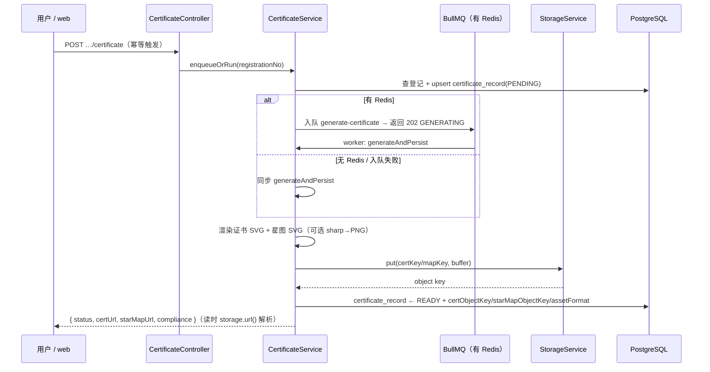
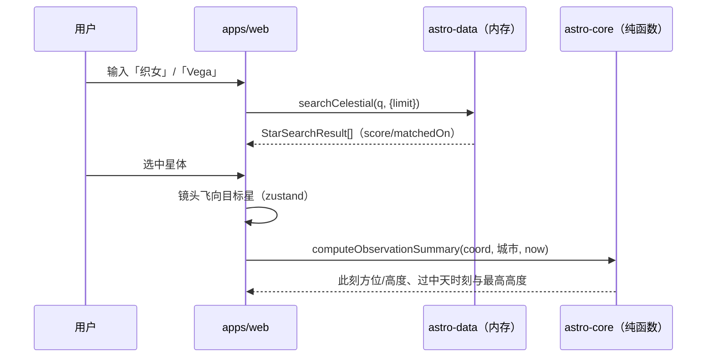
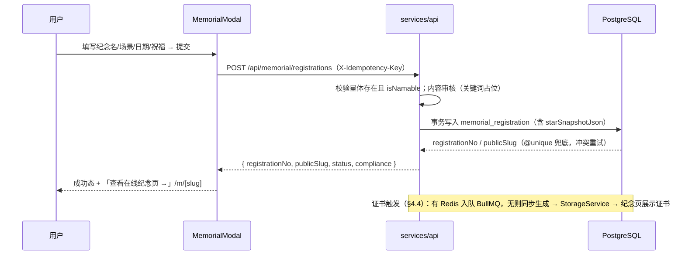

# 系统架构

> **定位**：给新加入的工程师 30 分钟看懂整个系统怎么组装、请求怎么流动、为什么这么选型。
> **读者**：全体工程师（前端 / 后端 / 数据）。
> **最后更新**：2026-07-11（Phase 3 · 商业闭环：证书生成 / Agent Skills / 存储抽象 / 审核后台）。
> **关联文档**：[数据模型](./data-model.md) · [API 规范](./api-spec.md) · [部署运维](./deployment.md)

---

## 1. 产品与合规定位

### 1.1 商业模式一句话

销售「**基于真实星体坐标的私人纪念命名礼物 + 情绪价值**」：用户在沉浸式星空中选定一颗
真实恒星（真实 J2000 坐标、真实星表编号），为重要的人登记纪念命名，获得纪念编号、
在线纪念页，以及后续的星图与证书。

### 1.2 合规红线（不可逾越）

- **绝不**宣传官方命名、IAU 认证、星体产权。任何文案不得出现「买星星」「拥有一颗星」等误导表述。
- 所有对外文案与所有返回纪念/命名数据的 API 响应，**必须**携带固定合规声明
  （`services/api/src/common/compliance.ts` 的 `COMPLIANCE_NOTICE`，文案不得删改）：

  > 本服务为基于真实星体坐标的私人纪念命名登记，仅具纪念意义，不代表国际天文学联合会（IAU）
  > 或任何官方机构的命名，不构成对该星体的任何权属。

- 前端命名弹窗、公开纪念页、未来的证书模板均须显式展示该声明（联动 [api-spec.md §1.5](./api-spec.md)）。

## 2. 总体拓扑

### 2.1 架构图

```mermaid
flowchart LR
  B[浏览器 / 未来小程序] -->|HTTPS| W["apps/web<br/>Next.js 15 + R3F"]
  B -->|"/api/* (直连或经 web 代理)"| A["services/api<br/>NestJS 11"]
  W -->|SSR fetch 公开纪念页| A
  A -->|Prisma| PG[(PostgreSQL)]
  A -->|"ioredis / BullMQ（有 REDIS_URL 时）"| RD[(Redis)]
  A -->|"OSS SDK（STORAGE_DRIVER=oss/auto+配齐）"| OSS[(阿里云 OSS)]
  A -->|"@anthropic-ai/sdk（有 API Key）"| AN[Anthropic Claude]
  A -->|"本地磁盘（无 OSS 降级）→ /api/assets"| LOCAL[(本地磁盘)]
  subgraph 共享包（TS 源码消费）
    C[packages/astro-core]
    D[packages/astro-data]
  end
  W -.import.-> C & D
  A -.import.-> C & D
```

（Redis / OSS / Anthropic 三项均**可选**，缺省各自优雅降级：无 Redis → 证书同步生成；
无 OSS → 本地磁盘 + `/api/assets`；无 API Key → 宇宙来信模板兜底。见 §4.3 / §4.5 / §4.6。）

### 2.2 Monorepo 布局

pnpm workspace（`apps/*`、`packages/*`、`services/*`）+ Turborepo 任务编排，统一 TypeScript、
统一 `tsconfig.base.json`（`strict` + `noUncheckedIndexedAccess`）。

| 目录 | 包名 | 职责 |
| --- | --- | --- |
| `apps/web` | `@star/web` | PC 沉浸式星空前端（Next.js App Router + React Three Fiber）；公开纪念页 `/m/[slug]` |
| `packages/astro-core` | `@star/astro-core` | 共享天文计算：儒略日、GMST/LST、赤道→地平、可见性、最佳观测摘要 |
| `packages/astro-data` | `@star/astro-data` | 共享星体类型 `CelestialObject`、精选真实星表 `CELESTIAL_CATALOG`（60 颗）、中英文搜索 `searchCelestial` |
| `services/api` | `@star/api` | NestJS 11 后端：天体查询、纪念登记、证书/星图生成、Agent 技能、审核后台、健康检查；Prisma（PostgreSQL）+ Redis + OSS/本地存储 |
| `infra/` | — | `docker-compose.yml`（Postgres + Redis，真实环境用） |
| `docs/` | — | 本目录：架构 / 数据模型 / API 规范 / 部署运维 |

**基础设施三样约束（硬性）**：只允许 **PostgreSQL / Redis / 阿里云 OSS**。任何能力都必须映射到这三样：

| 能力 | 映射 | 说明 |
| --- | --- | --- |
| 主数据存储 | PostgreSQL | Prisma 数据访问，唯一事实来源 |
| 搜索 | Phase 2：进程内存目录 → Phase 3：Postgres `pg_trgm`/全文 | 不引入 Elasticsearch，见 [data-model.md §6](./data-model.md) |
| 队列 / 异步任务 | BullMQ（跑在 Redis 上） | 证书/星图生成入队；**无 Redis 时同步生成**（§4.3） |
| 缓存 / 限流 | Redis | 未配置 `REDIS_URL` 时整体优雅降级（`RedisService` status = `skipped`） |
| 文件（证书、星图 SVG/PNG） | 阿里云 OSS | 经 `StorageService` 抽象；缺省降级本地磁盘 + `/api/assets`，再退 data URL（§4.5） |
| AI 文案（宇宙来信等） | Anthropic Claude | 经 `LlmProvider` 抽象；无 `ANTHROPIC_API_KEY` 降级模板生成（§4.6） |

## 3. 共享包策略

### 3.1 TS 源码消费

`astro-core` / `astro-data` 的 `package.json` 中 `main` 直指 `./src/index.ts`，**不预构建**。
好处：改算法即时生效、无双份编译产物、类型永远最新；代价：每个消费方负责自己编译它们。

### 3.2 各消费方的编译方案

- **apps/web（Next.js）**：`next.config.ts` 的 `transpilePackages: ['@star/astro-core', '@star/astro-data']`，由 Next 自带编译链处理。
- **services/api（NestJS）**：见下方决策记录。

#### 决策记录：NestJS 如何消费 TS 源码共享包

- **现状**：共享包是 ESM 风格 TS 源码；Nest 运行时是 CJS；`tsc` 不重写 `paths` 别名，直接 `tsc` 编译会在运行时找不到 `@star/*`。
- **备选**：
  1. `tsc` + 运行时别名重写（`tsconfig-paths` / `tsc-alias`）——多一层运行时 hack，ESM/CJS 边界脆弱；
  2. **`nest build --webpack` 单文件打包（选定）**——ts-loader 走完整 TS 编译（保留 `emitDecoratorMetadata`），`webpack-node-externals` 把 node_modules 全部 external、仅 allowlist `/^@star\//` 把 workspace TS 源一并编进 `dist/main.js`。
- **选择理由**：产物是纯 CJS 单文件 + external 的 node_modules（含生成的 Prisma Client），不依赖运行时路径重写、不依赖 Node 对 ESM-TS 的加载，是 pnpm monorepo + 源码消费场景下最稳的组合。配置见 `services/api/nest-cli.json` 与 `services/api/webpack.config.js`。
- **配套**：`services/api/tsconfig.json` 用 `paths` 把 `@star/*` 指向包源码（typecheck 用）；jest 用 `moduleNameMapper` 做同样映射（单测用）。
- **验证方式**（本地容器无 DB/Redis/docker）：`prisma generate` + `tsc --noEmit` + `nest build` + `jest`（mock PrismaService），全程零外部依赖。

## 4. 后端架构（services/api）

### 4.1 NestJS 模块划分

| 模块 | 路径 | 职责 |
| --- | --- | --- |
| `CelestialModule` | `services/api/src/celestial/` | 天体搜索 + 详情。本期注入 `@star/astro-data` 内存目录，零 DB 依赖 |
| `MemorialModule` | `services/api/src/memorial/` | 纪念登记创建/查询、公开纪念页数据（附带已就绪证书）、内容审核（关键词占位实现） |
| `CertificateModule` | `services/api/src/certificate/` | 证书 + 星图（纯 SVG 拼装，可选 sharp PNG）→ `StorageService` 存储 → 落库 `certificate_record`；有 Redis 走 BullMQ、无则同步；含 `AssetController`（`/api/assets/*` 本地资产流，防路径穿越）（§4.4/§4.5） |
| `AgentModule` | `services/api/src/agent/` | Agent 技能编排：`SkillRegistry` 分发 + `LlmProvider` 抽象（Anthropic / 模板兜底）；技能「宇宙来信」`cosmic-letter`，落 `agent_task`（§4.6） |
| `AdminModule` | `services/api/src/admin/` | 纪念登记审核后台 API：`AdminGuard`（`x-admin-token`）+ 登记列表/approve/reject + agent 任务观测（§4.7） |
| `HealthModule` | `services/api/src/health/` | `GET /api/health`：自身可用即 200，DB/Redis 状态放 body |
| `PrismaModule` | `services/api/src/prisma/` | 全局 `PrismaService`：启动探测连接，失败不 crash，需 DB 的接口返回 503 `DB_UNAVAILABLE` |
| `RedisModule` | `services/api/src/redis/` | 全局 `RedisService`：`REDIS_URL` 未配置整体降级为 noop |
| `common/` | `services/api/src/common/` | 合规声明、业务错误码（`AppError`，Phase 3 增 6 码）、全局异常过滤器、编号/slug 生成器 |
| `OrderModule` | （Phase 3+ 预留） | 订单支付；库表 `order` 已建，模块未启用 |

**数据源双轨（关键决策）**：

- `CelestialService` 直接注入 `@star/astro-data` 内存目录（`CELESTIAL_CATALOG` / `searchCelestial` /
  `getCelestialByUid`），与前端共享**同一份**搜索打分代码，行为完全一致，零 DB 依赖。
- `MemorialService` **强依赖 Prisma，不做内存 fallback**。纪念登记是付费凭证的前身，
  编号/slug 的唯一性和持久性是商业承诺；内存 fallback 会产出「重启即丢」的编号。
  无 DB 时返回明确的 `503 DB_UNAVAILABLE`；单测用 mock PrismaService 覆盖业务逻辑。

### 4.2 Prisma 数据访问与事务边界

- Schema 唯一事实来源：`services/api/prisma/schema.prisma`，逐表说明见 [data-model.md](./data-model.md)。
- 创建登记的写入以**单事务**完成（登记主行 + 快照 JSON 一次写入）；`registrationNo` / `publicSlug`
  唯一性由 DB `@unique` 约束兜底，冲突时上层重试重新生成（碰撞概率详见 [data-model.md §4](./data-model.md)）。
- 写入时**快照星体数据**（`starSnapshotJson`）：证书/纪念页展示以登记那一刻的星体字段为准，
  不受未来星表数据修订影响；同时保留 `starObjectUid` 外键（真实环境要求先跑 seed）。

### 4.3 BullMQ 队列（已启用，条件挂载）

- 拓扑：仅依赖 Redis。**有 `REDIS_URL` 时** `CertificateModule` 动态挂载 BullMQ（队列名 `certificate`，
  job `generate-certificate`），`api` 进程作 producer 投递、`certificate.processor.ts` 作 worker 消费，
  调用 `CertificateService.generateAndPersist`。
- **无 Redis 同步降级（关键）**：`enqueueOrRun` 检测 `RedisService.getStatus() !== 'up'`（或入队失败）
  时**直接同步** `generateAndPersist`，POST 直接返回 `READY`——本地/CI 无 Redis 也能出证书，绝不阻塞。
- 幂等：`certificate_record` 以 `@@unique([registrationId, templateVersion])` 为锚点；
  `READY`/`GENERATING` 直接返回既有记录，不重复渲染。
- worker 进程形态（同进程 / 拆独立进程）定稿见 [deployment.md §6.3](./deployment.md)。

### 4.4 证书 + 星图生成时序（零无头浏览器）

证书主图与星图**纯 SVG 字符串拼装**（`certificate/svg/*`：模板、局部天区 gnomonic 投影、
邻域星高亮），无 Puppeteer/Playwright 等无头浏览器；`sharp` 可用时把 SVG 栅格成 PNG，
不可用则只出 SVG（`assetFormat` 记录实际格式）。星图邻域星取自 `@star/astro-data` 活目录（装饰性，不进快照）。



证书响应必带 `COMPLIANCE_NOTICE`；证书模板文案同样内嵌合规红线（不得出现官方命名/IAU/购买/产权表述）。

### 4.5 存储抽象与降级（StorageService）

- DI token `STORAGE_SERVICE`，接口 `put(key, buf, contentType) / url(key)`；`certificate.module.ts`
  的 provider 工厂按 `STORAGE_DRIVER`（`auto`|`local`|`oss`|`dataurl`）选实现：
  - `auto`（默认）：四项 `OSS_*` 配齐 → `OssStorage`，否则 `LocalStorage`。
  - `OssStorage`：`ali-oss` **懒加载**（`eval('require')` 规避 webpack 静态分析；本期不安装，代码完备默认不激活），
    `url()` 返回**短时签名 URL**（`ASSET_URL_TTL`）。
  - `LocalStorage`：写磁盘（`STORAGE_LOCAL_DIR`），`url()` 派生 `STORAGE_PUBLIC_BASE_URL` + `/api/assets/<key>`；
    由 `AssetController` 流式服务，`resolveLocalPath` 做**路径穿越防护**（越界 → `ASSET_NOT_FOUND`）。
  - **写盘失败再降级 data URL**：极端只读环境也能返回可渲染资产，绝不 500。
- 存 **object key** 而非成品 URL：OSS 签名短时效读时现算、本地由 key 派生（[data-model.md §5](./data-model.md)）。

### 4.6 Agent Skills 与 LlmProvider 抽象

- **契约层**（`agent/skill.types.ts`）：`Skill`（`code` / `parseInput` / `run`）、`SkillContext`（注入 `llm`）、
  `SkillResult`（`output` / `mode: 'llm'|'template'` / `modelName`）；`SkillRegistry` 注册 + 按 `skillCode` 分发。
- **LlmProvider 抽象**（DI token `LLM_PROVIDER`）：`provider.factory.ts` 按 `ANTHROPIC_API_KEY` 选
  `AnthropicProvider`（`@anthropic-ai/sdk`，模型 `claude-sonnet-5`，`maxTokens` 受限控成本）或
  `TemplateProvider`（无 key/调用失败时的模板兜底）——**绝不因缺 key 崩溃**。
- **技能「宇宙来信」`cosmic-letter`**：据星体/星座/场景/纪念对象/语气生成中文来信；系统提示词内嵌合规红线。
  `AgentService.runSkill` 落 `agent_task`（`RUNNING → SUCCEEDED/FAILED`，记 `modelName`/`durationMs`）；
  **DB 不可用时跳过落库、`taskNo:'unpersisted'`，仍返回来信**（商业价值优先）。失败统一 `SKILL_FAILED`。
- 速率/成本防护（Redis 令牌桶，`skipped`/`down` fail-open）为占位 TODO，见 [api-spec.md §8](./api-spec.md)。

### 4.7 审核后台（AdminModule）

- `AdminGuard`：请求头 `x-admin-token` 与 `ADMIN_API_TOKEN` 用 `crypto.timingSafeEqual` 定长比较。
  **未配置 token → `503 ADMIN_NOT_ENABLED`（拒绝裸奔）**；配置但缺失/不匹配 → `401 ADMIN_UNAUTHORIZED`；
  在 `canActivate` 内实时读 `process.env`（便于测试、不引 `@nestjs/config`）。Guard 抛 `AppError`，由既有全局过滤器转 envelope。
- 端点：登记分页列表（可按 status 过滤，**返回含隐私/内部字段的管理员全量视图**，不带 `COMPLIANCE_NOTICE`）、
  approve / reject（审计落 `reviewNote`）、agent 任务分页观测。状态流转矩阵与非法流转 `409 INVALID_STATE_TRANSITION` 见 [api-spec.md §9](./api-spec.md)。
- 与登记初始状态联动：`REVIEW_ALL_FREETEXT=1` 时含自由文本的登记先进 `PENDING_REVIEW`，由后台 approve 转 `ACTIVE`。

### 4.8 搜索路径演进

- **Phase 2/3（现状）**：`@star/astro-data` 内存目录支撑（扩容后 5058 颗仍是毫秒级）。
- **Phase 3**：Postgres `pg_trgm` + 全文检索，基于 `celestial_name_alias.aliasNorm`。
  切换点集中在 `CelestialService` 一个类里（接口签名不变，调用方无感）。
  打分等价性对照与切换步骤见 [data-model.md §6](./data-model.md)。

## 5. 前端架构（apps/web）

### 5.1 R3F 星空渲染管线与状态

- 全屏 R3F `Canvas`：程序化环境星场 + 银河带 + 星云 + 渐变天穹 + 真实精选星表点位；
  第一人称拖拽环视 / 滚轮缩放 / 自动旋转，搜索或点击后镜头平滑飞向目标星。
- 全局状态用 zustand（`apps/web/src/lib/store.ts` 的 `useUniverse`）：当前选中星、
  相机飞行目标、观测城市、弹窗开关。
- **后续工作项（扩容配套，本期不做）**：星表扩到 ~5000 颗后，目标星点位渲染需改为
  `InstancedMesh` / `BufferGeometry` 单 draw call，按 `renderPriority` 分包渐进加载
  （见 [data-model.md §8.3](./data-model.md)）。

### 5.2 数据获取策略：静态内嵌 vs API

| 数据 | 来源 | 理由 |
| --- | --- | --- |
| 星体目录 + 搜索 | 静态内嵌（直接 `import '@star/astro-data'`） | 60 颗（乃至 5000 颗分层后的骨架档）体积可控；搜索零延迟；离线可用 |
| 可见性计算 | 纯前端 `@star/astro-core` | 纯函数、无密态数据，放前端省一次往返（见 [api-spec.md §5](./api-spec.md)） |
| 纪念登记 | `POST /api/memorial/registrations` | 必须持久化 + 服务端编号 |
| 公开纪念页 `/m/[slug]` | 服务端组件 fetch `GET /api/memorial/public/:slug`（ISR 60s） | 秒开、可被微信内置浏览器打开、不引 WebGL |

**API 客户端唯一通信层**：`apps/web/src/lib/api.ts`。「是否有后端」的判断全部收敛于此——
未配置 `NEXT_PUBLIC_API_BASE_URL`、网络错误、超时、非 2xx、信封 `code !== 'OK'`，
一律优雅回退**演示模式**（本地生成同格式编号，UI 恒定走向成功态，绝不向用户抛错）。
扩容后 5000 星的分层加载策略见 [data-model.md §8](./data-model.md)。

## 6. 关键流程时序

### 6.1 搜索选星 → 可见性计算（纯前端）



### 6.2 纪念命名登记（Phase 2 起走后端）



后端不可达时 `W` 直接本地回退演示模式（编号同格式 `STAR-YYYYMMDD-XXXX`，UI 标注「演示模式」）。
前端演示用的 `makeDemoRegistrationNo()` 仅作回退，**正式编号一律由后端
`services/api/src/common/ids/registration-no.ts` 生成**（CSPRNG + 去混淆字母表 + DB 唯一约束）。

## 7. 环境与部署形态（概览）

三种环境：本地开发容器（无 docker / PG / Redis，只做 typecheck + build + 单测）、
真实开发机（`infra/docker-compose.yml` 起 Postgres + Redis）、生产（托管 PG/Redis + OSS）。
`api` 与 `web` 各自独立进程，`api` 默认 3001、`web` 3000。全量环境变量、启动顺序、
故障排查见 [deployment.md](./deployment.md)。

## 8. 技术选型定稿（不可变更清单）

| 项 | 定稿 |
| --- | --- |
| 后端框架 | NestJS 11 |
| ORM | Prisma（PostgreSQL） |
| 基础设施 | 仅 PostgreSQL / Redis / 阿里云 OSS 三样 |
| 队列 | BullMQ（跑在 Redis 上） |
| 搜索 | Postgres（pg_trgm/全文）；Phase 2 暂由 astro-data 内存目录支撑 |
| 包管理 / 编排 | pnpm workspace + Turborepo |
| Node | 22 |
| 共享包消费 | TS 源码直连（`main: ./src/index.ts`），Next `transpilePackages` / Nest webpack bundle |

## 9. 演进路线

| Phase | 边界 |
| --- | --- |
| **1（已完成）** | 沉浸式星空前端 + 共享天文包 + 60 颗精选星表 + 纯前端演示命名 |
| **2** | NestJS API 地基：天体搜索/详情、纪念登记落库、公开纪念页 `/m/[slug]`、Prisma schema 全量主表、docker-compose 与部署文档 |
| **3（本期）** | 商业闭环：证书 + 星图生成（纯 SVG，BullMQ / 无 Redis 同步降级）→ `StorageService`（OSS / 本地磁盘 / data URL 降级）、Agent Skills（宇宙来信，`LlmProvider` Anthropic / 模板降级）、审核后台 API（`AdminGuard`）、星表扩容 ETL 落地（HYG v41 → 5058 颗）。订单支付、搜索 DB 化留待后续 |
| **4** | 微信小程序扫码找星、情侣双星、纪念册、实体礼盒供应链；订单支付、内容安全云审核、搜索 DB 化（pg_trgm） |
