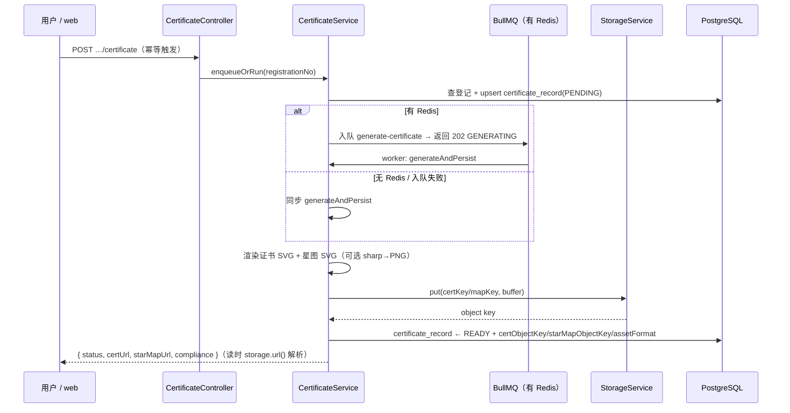
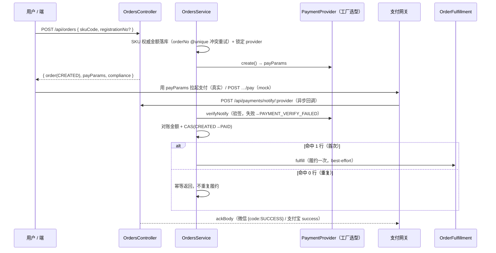
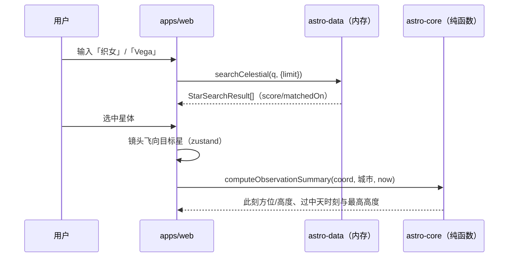
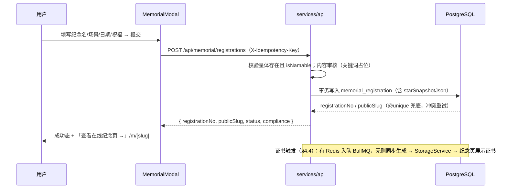
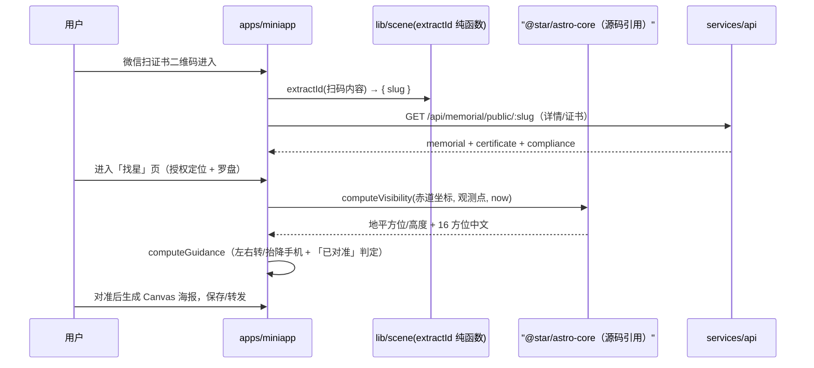

# 系统架构

> **定位**：给新加入的工程师 30 分钟看懂整个系统怎么组装、请求怎么流动、为什么这么选型。
> **读者**：全体工程师（前端 / 后端 / 数据）。
> **最后更新**：2026-07-11（Phase 6B · 天象日历与体验层：/almanac 天象+月相日历 / 深空科普 / 红光护眼 / 分享海报 / 行星轨迹+黄道带 / 人造卫星 SGP4 / 彗星与小行星 / 陀螺仪指星 / 环境音 / PWA）。
> **关联文档**：[数据模型](./data-model.md) · [API 规范](./api-spec.md) · [部署运维](./deployment.md)

---

## 1. 产品与合规定位

### 1.1 商业模式一句话

销售「**基于真实星体坐标的私人纪念命名礼物 + 情绪价值**」：用户在沉浸式星空中选定一颗
真实恒星（真实 J2000 坐标、真实星表编号），为重要的人登记纪念命名，获得纪念编号、
在线纪念页，以及后续的星图与证书。

### 1.2 合规红线（不可逾越）

- **绝不**宣传官方命名、IAU 认证、星体产权。任何文案不得出现「买星星」「拥有一颗星」等误导表述。
- 所有对外文案与所有返回纪念/命名数据的 API 响应，**必须**携带固定合规声明
  （`services/api/src/common/compliance.ts` 的 `COMPLIANCE_NOTICE`，文案不得删改）：

  > 本服务为基于真实星体坐标的私人纪念命名登记，仅具纪念意义，不代表国际天文学联合会（IAU）
  > 或任何官方机构的命名，不构成对该星体的任何权属。

- 前端命名弹窗、公开纪念页、未来的证书模板均须显式展示该声明（联动 [api-spec.md §1.5](./api-spec.md)）。

## 2. 总体拓扑

### 2.1 架构图

```mermaid
flowchart LR
  B[浏览器] -->|HTTPS| W["apps/web<br/>Next.js 15 + R3F"]
  MP["apps/miniapp<br/>微信小程序"] -->|"扫证书二维码进入 → /api/*"| A["services/api<br/>NestJS 11"]
  B -->|"/api/* (直连或经 web 代理)"| A
  W -->|SSR fetch 公开纪念页| A
  A -->|Prisma| PG[(PostgreSQL)]
  A -->|"ioredis / BullMQ（有 REDIS_URL 时）"| RD[(Redis)]
  A -->|"OSS SDK（STORAGE_DRIVER=oss/auto+配齐）"| OSS[(阿里云 OSS)]
  A -->|"@anthropic-ai/sdk（有 API Key）"| AN[Anthropic Claude]
  A -->|"支付 provider（wechat/alipay/mock）"| PAY[支付网关]
  A -->|"本地磁盘（无 OSS 降级）→ /api/assets"| LOCAL[(本地磁盘)]
  subgraph 共享包（TS 源码消费）
    C[packages/astro-core]
    D[packages/astro-data]
  end
  W -.import.-> C & D
  A -.import.-> C & D
  MP -.import（源码引用）.-> C
```

（Redis / OSS / Anthropic / 支付网关均**可选**，缺省各自优雅降级：无 Redis → 证书/纪念册同步生成；
无 OSS → 本地磁盘 + `/api/assets`；无 API Key → 宇宙来信模板兜底；无支付凭证 → mock provider。见 §4.3 / §4.5 / §4.6 / §4.9。
小程序**不直连**共享包运行时，而是源码引用 `@star/astro-core`（本期只做 typecheck，见 §3.2 / §6.3）。）

### 2.2 Monorepo 布局

pnpm workspace（`apps/*`、`packages/*`、`services/*`）+ Turborepo 任务编排，统一 TypeScript、
统一 `tsconfig.base.json`（`strict` + `noUncheckedIndexedAccess`）。

| 目录 | 包名 | 职责 |
| --- | --- | --- |
| `apps/web` | `@star/web` | PC 沉浸式星空前端（Next.js App Router + React Three Fiber）；公开纪念页 `/m/[slug]`、情侣页 `/couple/[slug]`、天象日历 `/almanac`（独立 chunk，见 §5.5） |
| `apps/miniapp` | `@star/miniapp` | 微信小程序「扫码找星」：扫证书二维码 → 展示纪念星/祝福/宇宙来信 → 手机罗盘方向引导在真实天空找到那颗星 → 生成海报分享；源码引用 `@star/astro-core` 一套算法多端一致 |
| `packages/astro-core` | `@star/astro-core` | 共享天文计算：儒略日、GMST/LST、赤道→地平、可见性、最佳观测摘要 |
| `packages/astro-data` | `@star/astro-data` | 共享星体类型 `CelestialObject`、精选真实星表 `CELESTIAL_CATALOG`（60 颗）、中英文搜索 `searchCelestial` |
| `packages/astro-ephem` | `@star/astro-ephem` | astronomy-engine（MIT）包装：行星日月星历 `getEquatorial`/月相、天象事件搜索 `events`（月相四相/日月食/合/冲/大距/二分二至，§5.5）、小天体开普勒 `minorBodies`（§5.5）。边界纪律：时间出入口统一 epoch ms（UTC），`AstroTime` 不出包边界 |
| `services/api` | `@star/api` | NestJS 11 后端：天体查询、纪念登记、证书/星图生成、Agent 技能、审核后台、健康检查；Prisma（PostgreSQL）+ Redis + OSS/本地存储 |
| `infra/` | — | `docker-compose.yml`（Postgres + Redis，真实环境用） |
| `docs/` | — | 本目录：架构 / 数据模型 / API 规范 / 部署运维 |

**基础设施三样约束（硬性）**：只允许 **PostgreSQL / Redis / 阿里云 OSS**。任何能力都必须映射到这三样：

| 能力 | 映射 | 说明 |
| --- | --- | --- |
| 主数据存储 | PostgreSQL | Prisma 数据访问，唯一事实来源 |
| 搜索 | Phase 2：进程内存目录 → Phase 3：Postgres `pg_trgm`/全文 | 不引入 Elasticsearch，见 [data-model.md §6](./data-model.md) |
| 队列 / 异步任务 | BullMQ（跑在 Redis 上） | 证书/星图生成入队；**无 Redis 时同步生成**（§4.3） |
| 缓存 / 限流 | Redis | 未配置 `REDIS_URL` 时整体优雅降级（`RedisService` status = `skipped`） |
| 文件（证书、星图 SVG/PNG） | 阿里云 OSS | 经 `StorageService` 抽象；缺省降级本地磁盘 + `/api/assets`，再退 data URL（§4.5） |
| AI 文案（宇宙来信等） | Anthropic Claude | 经 `LlmProvider` 抽象；无 `ANTHROPIC_API_KEY` 降级模板生成（§4.6） |

## 3. 共享包策略

### 3.1 TS 源码消费

`astro-core` / `astro-data` 的 `package.json` 中 `main` 直指 `./src/index.ts`，**不预构建**。
好处：改算法即时生效、无双份编译产物、类型永远最新；代价：每个消费方负责自己编译它们。

### 3.2 各消费方的编译方案

- **apps/web（Next.js）**：`next.config.ts` 的 `transpilePackages: ['@star/astro-core', '@star/astro-data']`，由 Next 自带编译链处理。
- **services/api（NestJS）**：见下方决策记录。
- **apps/miniapp（微信小程序）**：**源码引用 + tsconfig paths**，不走微信「构建 npm」，见本节决策记录。

#### 决策记录：微信小程序如何消费 astro-core（源码引用，不用「构建 npm」）

- **现状**：`astro-core` 是 `type:module` 纯 TS、`main` 直指 `src/index.ts`，**没有可分发的 JS dist**。
  微信「构建 npm」从 `node_modules` 读包并要求可用的 JS 入口，遇到 TS 源码入口会失败。
- **结论（选定）**：`apps/miniapp/tsconfig.json` 用 `paths` 把 `@star/astro-core` 解析到
  `../../packages/astro-core/src/index.ts` 并 `include` 该源码进 typecheck 范围——业务代码统一
  `import { computeVisibility, computeObservationSummary, azimuthToDirection } from '@star/astro-core'`，
  「一套算法多端一致」（单一真源）成立。astro-core 零依赖、纯函数、无 `wx.*`/DOM/Node API，微信 TS 编译器可就地编译。
- **接真机的 vendor 步骤**（本期不落地产物）：`node scripts/vendor-astro.mjs` 把 astro-core 6 个纯 TS 源码复制进
  `miniprogram/lib/astro-core/`（可就地被微信 TS 插件编译），再把 `paths` 改指本地副本。避免重复源码入库，已 `.gitignore` 忽略。
- **验证方式**（无微信运行时）：`pnpm --filter @star/miniapp typecheck`（覆盖 miniprogram 全部 `.ts` + 共享 astro-core 源码）
  + `project.config.json`（`miniprogramRoot=miniprogram/`、`useCompilerPlugins:['typescript']`、占位 `appid`）可在微信开发者工具「导入项目」打开。

#### 决策记录：NestJS 如何消费 TS 源码共享包

- **现状**：共享包是 ESM 风格 TS 源码；Nest 运行时是 CJS；`tsc` 不重写 `paths` 别名，直接 `tsc` 编译会在运行时找不到 `@star/*`。
- **备选**：
  1. `tsc` + 运行时别名重写（`tsconfig-paths` / `tsc-alias`）——多一层运行时 hack，ESM/CJS 边界脆弱；
  2. **`nest build --webpack` 单文件打包（选定）**——ts-loader 走完整 TS 编译（保留 `emitDecoratorMetadata`），`webpack-node-externals` 把 node_modules 全部 external、仅 allowlist `/^@star\//` 把 workspace TS 源一并编进 `dist/main.js`。
- **选择理由**：产物是纯 CJS 单文件 + external 的 node_modules（含生成的 Prisma Client），不依赖运行时路径重写、不依赖 Node 对 ESM-TS 的加载，是 pnpm monorepo + 源码消费场景下最稳的组合。配置见 `services/api/nest-cli.json` 与 `services/api/webpack.config.js`。
- **配套**：`services/api/tsconfig.json` 用 `paths` 把 `@star/*` 指向包源码（typecheck 用）；jest 用 `moduleNameMapper` 做同样映射（单测用）。
- **验证方式**（本地容器无 DB/Redis/docker）：`prisma generate` + `tsc --noEmit` + `nest build` + `jest`（mock PrismaService），全程零外部依赖。

## 4. 后端架构（services/api）

### 4.1 NestJS 模块划分

| 模块 | 路径 | 职责 |
| --- | --- | --- |
| `CelestialModule` | `services/api/src/celestial/` | 天体搜索 + 详情。本期注入 `@star/astro-data` 内存目录，零 DB 依赖 |
| `MemorialModule` | `services/api/src/memorial/` | 纪念登记创建/查询、公开纪念页数据（附带已就绪证书）、内容审核（关键词占位实现）；**情侣双星** `createCouple`/`findCouplePublicBySlug`（§4.8） |
| `CertificateModule` | `services/api/src/certificate/` | 证书 + 星图（纯 SVG 拼装，可选 sharp PNG）→ `StorageService` 存储 → 落库 `certificate_record`；有 Redis 走 BullMQ、无则同步；含 `AssetController`（`/api/assets/*` 本地资产流，防路径穿越）（§4.4/§4.5） |
| `AlbumModule` | `services/api/src/album/` | 纪念册：6 页暗黑高级风 SVG + 合并长图，**复用 certificate 的 SVG 基建**与 `enqueueOrRun` 幂等/降级；`letter` 页调 `cosmic-letter` skill；有 Redis 走 BullMQ（队列 `album`）、无则同步（§4.10） |
| `OrdersModule` | `services/api/src/orders/` | 订单与支付骨架：`SKU_CATALOG` 服务端权威金额、`PaymentProvider` 抽象（mock/wechat/alipay，工厂降级 mock）、回调验签 + 对账 + CAS 幂等履约（§4.9） |
| `AgentModule` | `services/api/src/agent/` | Agent 技能编排：`SkillRegistry` 分发 + `LlmProvider` 抽象（Anthropic / 模板兜底）；技能「宇宙来信」`cosmic-letter`，落 `agent_task`（§4.6） |
| `AdminModule` | `services/api/src/admin/` | 纪念登记审核后台 API：`AdminGuard`（`x-admin-token`）+ 登记列表/approve/reject + agent 任务观测（§4.7） |
| `HealthModule` | `services/api/src/health/` | `GET /api/health`：自身可用即 200，DB/Redis 状态放 body |
| `PrismaModule` | `services/api/src/prisma/` | 全局 `PrismaService`：启动探测连接，失败不 crash，需 DB 的接口返回 503 `DB_UNAVAILABLE` |
| `RedisModule` | `services/api/src/redis/` | 全局 `RedisService`：`REDIS_URL` 未配置整体降级为 noop |
| `common/` | `services/api/src/common/` | 合规声明、业务错误码（`AppError`，Phase 4 增 couple/order/payment 共 8 码）、全局异常过滤器、编号/slug 生成器 |

**数据源双轨（关键决策）**：

- `CelestialService` 直接注入 `@star/astro-data` 内存目录（`CELESTIAL_CATALOG` / `searchCelestial` /
  `getCelestialByUid`），与前端共享**同一份**搜索打分代码，行为完全一致，零 DB 依赖。
- `MemorialService` **强依赖 Prisma，不做内存 fallback**。纪念登记是付费凭证的前身，
  编号/slug 的唯一性和持久性是商业承诺；内存 fallback 会产出「重启即丢」的编号。
  无 DB 时返回明确的 `503 DB_UNAVAILABLE`；单测用 mock PrismaService 覆盖业务逻辑。

### 4.2 Prisma 数据访问与事务边界

- Schema 唯一事实来源：`services/api/prisma/schema.prisma`，逐表说明见 [data-model.md](./data-model.md)。
- 创建登记的写入以**单事务**完成（登记主行 + 快照 JSON 一次写入）；`registrationNo` / `publicSlug`
  唯一性由 DB `@unique` 约束兜底，冲突时上层重试重新生成（碰撞概率详见 [data-model.md §4](./data-model.md)）。
- 写入时**快照星体数据**（`starSnapshotJson`）：证书/纪念页展示以登记那一刻的星体字段为准，
  不受未来星表数据修订影响；同时保留 `starObjectUid` 外键（真实环境要求先跑 seed）。

### 4.3 BullMQ 队列（已启用，条件挂载）

- 拓扑：仅依赖 Redis。**有 `REDIS_URL` 时** `CertificateModule` 动态挂载 BullMQ（队列名 `certificate`，
  job `generate-certificate`），`api` 进程作 producer 投递、`certificate.processor.ts` 作 worker 消费，
  调用 `CertificateService.generateAndPersist`。
- **无 Redis 同步降级（关键）**：`enqueueOrRun` 检测 `RedisService.getStatus() !== 'up'`（或入队失败）
  时**直接同步** `generateAndPersist`，POST 直接返回 `READY`——本地/CI 无 Redis 也能出证书，绝不阻塞。
- 幂等：`certificate_record` 以 `@@unique([registrationId, templateVersion])` 为锚点；
  `READY`/`GENERATING` 直接返回既有记录，不重复渲染。
- worker 进程形态（同进程 / 拆独立进程）定稿见 [deployment.md §6.3](./deployment.md)。

### 4.4 证书 + 星图生成时序（零无头浏览器）

证书主图与星图**纯 SVG 字符串拼装**（`certificate/svg/*`：模板、局部天区 gnomonic 投影、
邻域星高亮），无 Puppeteer/Playwright 等无头浏览器；`sharp` 可用时把 SVG 栅格成 PNG，
不可用则只出 SVG（`assetFormat` 记录实际格式）。星图邻域星取自 `@star/astro-data` 活目录（装饰性，不进快照）。



证书响应必带 `COMPLIANCE_NOTICE`；证书模板文案同样内嵌合规红线（不得出现官方命名/IAU/购买/产权表述）。

### 4.5 存储抽象与降级（StorageService）

- DI token `STORAGE_SERVICE`，接口 `put(key, buf, contentType) / url(key)`；`certificate.module.ts`
  的 provider 工厂按 `STORAGE_DRIVER`（`auto`|`local`|`oss`|`dataurl`）选实现：
  - `auto`（默认）：四项 `OSS_*` 配齐 → `OssStorage`，否则 `LocalStorage`。
  - `OssStorage`：`ali-oss` **懒加载**（`eval('require')` 规避 webpack 静态分析；本期不安装，代码完备默认不激活），
    `url()` 返回**短时签名 URL**（`ASSET_URL_TTL`）。
  - `LocalStorage`：写磁盘（`STORAGE_LOCAL_DIR`），`url()` 派生 `STORAGE_PUBLIC_BASE_URL` + `/api/assets/<key>`；
    由 `AssetController` 流式服务，`resolveLocalPath` 做**路径穿越防护**（越界 → `ASSET_NOT_FOUND`）。
  - **写盘失败再降级 data URL**：极端只读环境也能返回可渲染资产，绝不 500。
- 存 **object key** 而非成品 URL：OSS 签名短时效读时现算、本地由 key 派生（[data-model.md §5](./data-model.md)）。

### 4.6 Agent Skills 与 LlmProvider 抽象

- **契约层**（`agent/skill.types.ts`）：`Skill`（`code` / `parseInput` / `run`）、`SkillContext`（注入 `llm`）、
  `SkillResult`（`output` / `mode: 'llm'|'template'` / `modelName`）；`SkillRegistry` 注册 + 按 `skillCode` 分发。
- **LlmProvider 抽象**（DI token `LLM_PROVIDER`）：`provider.factory.ts` 按 `ANTHROPIC_API_KEY` 选
  `AnthropicProvider`（`@anthropic-ai/sdk`，模型 `claude-sonnet-5`，`maxTokens` 受限控成本）或
  `TemplateProvider`（无 key/调用失败时的模板兜底）——**绝不因缺 key 崩溃**。
- **技能「宇宙来信」`cosmic-letter`**：据星体/星座/场景/纪念对象/语气生成中文来信；系统提示词内嵌合规红线。
  `AgentService.runSkill` 落 `agent_task`（`RUNNING → SUCCEEDED/FAILED`，记 `modelName`/`durationMs`）；
  **DB 不可用时跳过落库、`taskNo:'unpersisted'`，仍返回来信**（商业价值优先）。失败统一 `SKILL_FAILED`。
- 速率/成本防护（Redis 令牌桶，`skipped`/`down` fail-open）为占位 TODO，见 [api-spec.md §8](./api-spec.md)。

### 4.7 审核后台（AdminModule）

- `AdminGuard`：请求头 `x-admin-token` 与 `ADMIN_API_TOKEN` 用 `crypto.timingSafeEqual` 定长比较。
  **未配置 token → `503 ADMIN_NOT_ENABLED`（拒绝裸奔）**；配置但缺失/不匹配 → `401 ADMIN_UNAUTHORIZED`；
  在 `canActivate` 内实时读 `process.env`（便于测试、不引 `@nestjs/config`）。Guard 抛 `AppError`，由既有全局过滤器转 envelope。
- 端点：登记分页列表（可按 status 过滤，**返回含隐私/内部字段的管理员全量视图**，不带 `COMPLIANCE_NOTICE`）、
  approve / reject（审计落 `reviewNote`）、agent 任务分页观测。状态流转矩阵与非法流转 `409 INVALID_STATE_TRANSITION` 见 [api-spec.md §9](./api-spec.md)。
- 与登记初始状态联动：`REVIEW_ALL_FREETEXT=1` 时含自由文本的登记先进 `PENDING_REVIEW`，由后台 approve 转 `ACTIVE`。

### 4.8 情侣双星（CoupleGroup，加法不改证书）

- **轻量分组模型**：新增 `CoupleGroup`（`coupleSlug`/`relationLabel`/`coupleBlessing`），两条普通
  `MemorialRegistration` 通过 `coupleGroupId`+`coupleRole(A/B)` 挂靠。`CoupleGroup` **不持有 status**——
  公开可见性以两条成员登记的 status 为准，**复用现有 admin approve/reject，无需改后台**。
- **决策：为何不用纯字段方案**：在登记表加 `coupleGroupId`/`coupleRole` 之外还需一个稳定的对外 `coupleSlug`
  与合并展示字段（relationLabel/coupleBlessing）；独立 group 让「一对」有主体、`@@unique([coupleGroupId, coupleRole])`
  防止写入两个 A（Postgres 唯一索引对 NULL 不去重，单星登记不受约束）。
- **事务与幂等**：`createCouple` 在**单事务**内建 group + 两条登记，任一 `@unique`（registrationNo/publicSlug/coupleSlug）
  冲突整体回滚换新 ID 重试；同星 → `COUPLE_SAME_STAR`；两名字/两祝福/标签**合并一次审核**。
- **证书/纪念册零改动**：两颗星各自按 `registrationNo` 走既有 certificate/album 接口。契约见 [api-spec.md §3.5/§3.6](./api-spec.md)。

### 4.9 订单支付抽象与状态机（OrdersModule · 骨架）

- **金额服务端权威**：前端只传 `skuCode`，金额从 `order.constants.ts` 的 `SKU_CATALOG` 取，**永不信任前端金额**；
  回调对账也以订单落库金额为准（不符 → 落 `payMeta.reconcileError`、不置 PAID）。
- **PaymentProvider 抽象**（DI token `PAYMENT_PROVIDER`）：`payment-provider.factory.ts` 按 `PAYMENT_PROVIDER`
  env 选 `WechatPayProvider`/`AlipayProvider`（凭证齐全且 `active`）或降级 `MockPaymentProvider`——**照抄
  `llm/provider.factory` 与 `storageFactory` 的工厂降级模式，绝不因缺凭证 crash**。接口：`create`/`verifyNotify`/`queryStatus`/`ackBody`。
- **状态机**：`CREATED →（回调/mock pay）→ PAID | FAILED`；`enum OrderStatus{CREATED PAID FAILED CANCELLED REFUNDED}`
  （FAILED=支付失败、CANCELLED=用户/超时取消，语义不同）。
- **CAS 幂等履约**：`updateMany(where status=CREATED → PAID)` 命中 1 行 = 首次成功 → `OrderFulfillmentService.fulfill`
  **一次**（best-effort，异常不回滚支付）；命中 0 行 = 已处理不重复履约。`providerTxnId @unique` 阻止「同一第三方交易被两个订单认领」。
- **履约分派**：按 `sku.fulfillment` — `UNLOCK_CERT`/`DUAL_STAR` → `CertificateService.enqueueOrRun`（幂等）；
  `MEMORIAL_BOOK` 本期占位 log（落地后接 AlbumService）；`PHYSICAL_*` 仅记录待发货。
- **测试后门收口**：`POST /api/orders/:orderNo/pay` **仅 `provider==='mock'` 可用**，真实订单 → `PAYMENT_PROVIDER_MISMATCH`。



### 4.10 纪念册生成（AlbumModule · 复用证书基建）

- **零新依赖、纯 SVG**：6 页（`cover → star-map → story → letter → astro → dedication`）W1200×H1600 与证书同尺寸，
  复用 `certificate/svg/*`（`svg-utils`/`format`/`projection`/`star-map`）与 `certificate.constants` 的 `XML_DECL`；
  PDF/长图走「多页 SVG 合并成竖排长图」的零依赖方案（`svg-embed` 把每页作嵌套视口注入）。
- **enqueueOrRun 幂等/降级**：与证书同构——有 Redis 走 BullMQ（队列 `album`、job `generate-album`），无 Redis 同步生成；
  幂等锚点 `album_record @@unique([registrationId, templateVersion])`，`READY`/`GENERATING` 直接返回。
- **宇宙来信页**：`letter` 页调 `AgentService.runSkill('cosmic-letter')`，失败/无 key 降级模板（`letterMode` 落库可观测），
  **绝不拖垮整册**。资产同走 `StorageService`（OSS 签名 / 本地 `/api/assets/*`）。契约见 [api-spec.md §11](./api-spec.md)。

### 4.11 搜索路径演进

- **Phase 2/3（现状）**：`@star/astro-data` 内存目录支撑（扩容后 5058 颗仍是毫秒级）。
- **Phase 3**：Postgres `pg_trgm` + 全文检索，基于 `celestial_name_alias.aliasNorm`。
  切换点集中在 `CelestialService` 一个类里（接口签名不变，调用方无感）。
  打分等价性对照与切换步骤见 [data-model.md §6](./data-model.md)。

## 5. 前端架构（apps/web）

### 5.1 R3F 星空渲染管线与状态

- 全屏 R3F `Canvas`：程序化环境星场 + 银河带 + 星云 + 渐变天穹 + 真实精选星表点位；
  第一人称拖拽环视 / 滚轮缩放 / 自动旋转，搜索或点击后镜头平滑飞向目标星。
- 全局状态用 zustand（`apps/web/src/lib/store.ts` 的 `useUniverse`）：当前选中星、
  相机飞行目标、观测城市、弹窗开关。
- **后续工作项（扩容配套，本期不做）**：星表扩到 ~5000 颗后，目标星点位渲染需改为
  `InstancedMesh` / `BufferGeometry` 单 draw call，按 `renderPriority` 分包渐进加载
  （见 [data-model.md §8.3](./data-model.md)）。

### 5.2 数据获取策略：静态内嵌 vs API

| 数据 | 来源 | 理由 |
| --- | --- | --- |
| 星体目录 + 搜索 | 静态内嵌（直接 `import '@star/astro-data'`） | 60 颗（乃至 5000 颗分层后的骨架档）体积可控；搜索零延迟；离线可用 |
| 可见性计算 | 纯前端 `@star/astro-core` | 纯函数、无密态数据，放前端省一次往返（见 [api-spec.md §5](./api-spec.md)） |
| 纪念登记 | `POST /api/memorial/registrations` | 必须持久化 + 服务端编号 |
| 公开纪念页 `/m/[slug]` | 服务端组件 fetch `GET /api/memorial/public/:slug`（ISR 60s） | 秒开、可被微信内置浏览器打开、不引 WebGL |

**API 客户端唯一通信层**：`apps/web/src/lib/api.ts`。「是否有后端」的判断全部收敛于此——
未配置 `NEXT_PUBLIC_API_BASE_URL`、网络错误、超时、非 2xx、信封 `code !== 'OK'`，
一律优雅回退**演示模式**（本地生成同格式编号，UI 恒定走向成功态，绝不向用户抛错）。
扩容后 5000 星的分层加载策略见 [data-model.md §8](./data-model.md)。

### 5.3 宇宙 V2：分层渲染与星座/星历（Phase 5）

场景按 renderOrder 严格分层，各层独立 draw call、互不重建几何：

| renderOrder | 层 | 实现要点 |
| --- | --- | --- |
| 0 | 天穹渐变 + 假星云氛围 / 程序化环境星场 | 真实 DSO 上线后假星云下调为极淡氛围 |
| 1 | 核心真实星场（mag≤6.5，≈9000 颗） | 单 `Points` 单 draw call（TwinkleStars 着色器） |
| 1 | 扩展星场（mag 6.5–7.5） | `public/data/stars-extended.json` 空闲懒加载，纯渲染层不参与拾取 |
| 1.5 | **星座艺术图**（20 幅自绘 SVG） | 切平面 Mesh 锚死天球姿态（非 billboard），懒加载 + LRU 纹理缓存 |
| 2 | **星座连线**（88 座全量） | 单 `LineSegments` 单 draw call，见下 |
| 2 | 深空天体（Messier + 亮 NGC/IC） | 按类型分组 Points |
| 4 | **星座中文名** | CanvasTexture Sprite（≤2 个），固定角尺寸随 FOV 缩放 |
| 8 | 行星日月 | 星历注册表（ephemRegistry）按 observeTime 实时驱动 |
| 9 | 选中高亮 | — |

**星座系统（Star Walk 式，`components/universe/Constellation*`）**：

- **数据**：`@star/astro-data` 的 `CONSTELLATION_LINES`（d3-celestial 连线，BSD-3；端点已吸附为
  objectUid，`CATALOG_BY_UID` 直查坐标零转换）。web 侧 `lib/constellation-render.ts` 构建期
  一次算出合并几何 + 每座质心（端点单位向量平均，规避 RA 绕圈）/外接角半径。
- **依次点亮**：每段的点亮时序在构建期折进顶点属性 `aT0/aT1`（单段 0.6s、逐段 stagger 0.08s），
  运行期 CPU 只把该座进度 `uProgress[i]` 从 0 匀速推到 1，shader 内一个 `smoothstep`
  即产生逐段亮起 + 呼吸（±12%）；失活 0.4s 整体淡出。88 float uniform 数组每帧上传 <0.4KB。
- **激活判定**（优先级 select > search > gaze）：注视判定 150ms 节流（移动 250ms）+ 88 次点积 +
  阈值 `clamp(rad×0.6, 8°, 20°)` + 3° 滞回 + 250ms 驻留确认；点选恒星联动其所属座（钉住）；
  搜索星座条目 → `constellationFocusNonce` 触发 CameraRig 飞向质心并把 FOV 缓回 60°；
  用户拖拽即解除钉住。状态在 `useUniverse`（`activeConstellation` / `activeConstellationSource`），
  帧内进度全部走 ref，零 React 抖动。
- **艺术图**：12 黄道 + 8 著名座的自绘 SVG 发光线稿（双描边法，CC0 原创，无第三方版权图像；
  猎户七星/北斗/仙后 W/秋季四边形/南十字四星等与真实星点像素级对位），透明度上限 0.35
  （移动 0.28），加色混合下永远压不过星点；其余 68 座连线 + 名称兜底。
- **降级**：`prefers-reduced-motion` 统一 0.2s 且冻结呼吸；coarse pointer 单艺术图 + 512² 纹理；
  「星座」开关（ControlBar）关闭即整层 unmount 并释放几何/纹理。
- **信息卡**：`ConstellationInfoCard`（左下角 DOM），88 条原创中文神话/看点简介
  （`lib/constellation-lore.ts`），最亮星可点击飞往；星座不可命名，卡内无购买入口。

### 5.4 宇宙 V3：交互与天象（Phase 6A · 悬停 / 时间机器 / 坐标线 / 晨昏地平线）

在 V3 视觉核心（真实银河全景 `MilkyWayLayer`、著名 DSO 真实照片 `DsoPhotoLayer`、
行星 3D 查看器 `planet3d/`，素材许可登记见 `public/credits.json` 与 [credits.md](./credits.md)）
之上，新增四组交互天象能力。渲染顺序增量：

| renderOrder | 层 | draw 增量 |
| --- | --- | --- |
| 0.5 | `GridLayer`（黄道 2 + 赤道 1 + 网格 1）+ `HorizonLayer` 地平线大圆 1 | 默认全关；开启才懒构建，关闭摘除不销毁 |
| 8.5 | `HorizonLayer` 暗罩球（shader） | 默认关；开 +1 |

- **悬停识别（D）**：`lib/hoverBus.ts` 模块单例（与 ephemRegistry 同一套「单例+回调」纪律，
  刻意不进 zustand）。`CameraRig` 在 pointermove 里 70ms 节流走统一拾取 `pickAt`
  （与点击共用遍历，悬停命中半径 ×0.75 减少擦边误报），节流间隙只挪坐标保持跟手；
  `HoverTooltip` 订阅回调**直改 DOM transform**——坐标高频更新零 React 重渲染，仅 uid
  变化才 setState 换名牌内容（中文名+类型+星等，素材复用 objectPresenter/solarSystem）。
  拖拽/滚轮/镜头飞行/离开画布即清空；coarse pointer（触屏）整条管线不注册；点击行为不变。
- **时间机器（E）**：`TimeMachineBar` 常驻挂载（UniverseApp），收起态为 ControlBar 左端的
  时钟按钮（偏离实时时琥珀高亮，`selectTimeTravel` 派生选择器）。播放循环在 rAF 闭包内累加
  权威时间（模拟秒 = 帧间隔 × timeSpeed，档位 ×1/1分/1时/1天/1周 每秒），**4Hz（250ms）节流**写
  `store.observeTime` → `EphemDriver` 重算星历 → 行星/月相/信息卡可见性/地平线/晨昏全链路联动；
  外部写入单向对齐（每帧比对「不是自己写出的值」即重置累加基准，无环）。实时模式
  （`timeFollowsNow` 且未播放）60s 心跳对齐 `Date.now()`，顺带驱动 LST/晨昏缓慢演化。
  UI：步进（±1时/±1天）、倍速 chips、`datetime-local`、±24h 弹簧滑条（松手回中可累积微调，
  播放中拖动先自动暂停）、「回到现在」一键复位。
- **坐标线（F）**：`GridLayer` 纯静态几何（J2000），分两组开关——黄道（金 `#d9b96e`，
  大圆 128 段 + 十二宫刻度单 LineSegments + 宫名 canvas Sprite ×12）；天赤道+RA/Dec 网格
  （青 `#6fd6d6` 赤道大圆；RA 12 条 + Dec ±30°/±60° 合并为**单 LineSegments ≈1800 顶点**，
  opacity 0.06 极淡）。默认全关零成本，首次开启才构建并缓存（ref 持有，重开零重建）。
- **晨昏与地平线（G，与 F 组3 共用 `showHorizon` 开关）**：`HorizonLayer` 三件套——
  ① 地平线大圆：`astro-core` 新增 `horizontalToEquatorial` 逆变换（Meeus 约定，往返自洽
  <1e-9°，含南半球/近天顶奇点单测）把 alt=0 大圆反投影回赤道系天球（120 点预分配缓冲，
  `useEffect([city, observeTime])` 原地重写 <0.2ms）；② 东南西北方位标 canvas Sprite（北=红橙）；
  ③ 全天球 ShaderMaterial 暗罩（1 draw，BackSide，renderOrder 8.5 压在行星之上）：片元用
  「顶点方向·天顶向量」≈ sin(高度角) 做地平线下渐变压暗（-6° 满值 0.35）+ 按太阳高度角
  JS 侧插值的晨昏色调（夜→民用晨昏金橙→白天淡青蓝，预乘 alpha 混合按比例压暗星光）。
  太阳坐标直接读 ephemRegistry（本层挂在 `EphemDriver` 之后，同 commit 内 effect 有序，
  读到的即当次 observeTime 新鲜值）；useFrame 内零计算。低端机暗罩球细分降为 32×20。
- **ControlBar 重组 + 显示设置面板**：ControlBar 只留高频四项（时间 / 情侣双星 / 回到全景 /
  显示 ⚙）；自动旋转/名称标签/星座/银河与新开关（黄道、赤道网格、地平线与晨昏、观测城市）
  收进 `DisplaySettings` 玻璃弹出面板，底部保留「影像与数据来源」入口（`creditsOpen` 升入
  store，`CreditsPanel` 与面板共用）。

帧循环纪律不变：新层一律 effect 驱动（useFrame 内零计算零分配）；hover 是事件驱动 70ms 节流；
时间机器 rAF 只累加闭包变量、4Hz 才碰 store。60fps 红线不受影响。

### 5.5 宇宙 V4：天象日历与体验层（Phase 6B）

Phase 6B 分三组：**天象日历与科普**（天象/月相日历、深空长文）、**轨道与动态天体**（行星轨迹+黄道带、
人造卫星、彗星/小行星）、**体验层**（红光护眼、分享海报、陀螺仪指星、环境音、PWA）。
本阶段**唯一新增 npm 依赖为 `satellite.js`（MIT，装 apps/web）**，其余零新依赖；
全部静态数据（流星雨表 / TLE 快照 / 轨道根数 / 科普长文）内置常量并注明来源与历元，
观测坐标**绝不编造、一律经公式计算**。新增动态天体全部 `isNamable=false`（合规红线不动）。

- **天象事件计算（`@star/astro-ephem` 新增 `events` 模块）**：包装 astronomy-engine 事件搜索
  （`SearchMoonQuarter` / `SearchLunarEclipse` / `SearchGlobalSolarEclipse` / `SearchMaxElongation` /
  `SearchRelativeLongitude` / `Seasons` / `PairLongitude` / `SearchRiseSet`），计算未来 12 个月：
  月相四相、日月食（全球日食统一标注「全球事件，本地可见性另查」，不擅自宣称本地可见）、
  行星合月/行星合（角距 <2°）、水金大距、外行星冲（相对黄经 180°）、二分二至、
  超级月亮（满月 ± 邻近近地点判定）。流星雨为**静态常识表**（英仙/双子/象限仪等约 10 大流星雨：
  极大期 + ZHR + 辐射点，公域天文常识，非计算）。坐标计算仍走既有 `ephemeris.ts`，事件模块只做搜索；
  单测用已知天文事实做宽容差锚点（如 2026 年满月日期 ±1 天、2026-08-12 英仙座极大 ±1 天）。
- **/almanac 独立路由**：server shell + `'use client'` 根组件，事件流 / 月相月历 / 提醒逻辑全部落在
  **独立 chunk**，不进主页 First Load（557kB 红线不受影响）。12 个月事件计算收敛在 hook 内
  （useMemo/分片），不卡 UI。提醒 = **零依赖手写 VEVENT** 生成 `.ics` 下载 + 可选浏览器
  Notification（仅页面开启期间的本地轮询，权限请求克制）。「在星图中查看」= 深链
  `/?t=&focus=&con=` 回主页，由 `DeepLinkBoot` 消费并只调用现有 `travelTo`/聚焦 action——
  **store 零修改**（多 agent 热点刻意避让）。月相月历：每日 SVG 月相小图标（按 illumination +
  盈亏程序绘制）+ `SearchRiseSet` 按 store 城市算当日月出月落 + 今日月相详情。
- **深空科普长文**：16 个有真实照片的 Messier 天体各 150–300 字**原创中文**科普（web 常量），
  StarInfoCard 对这些对象显示「了解更多」展开区 + 照片放大 lightbox（常驻署名，联动 credits）。
- **人造卫星（SGP4 · satellite.js）**：内置 ISS / 天宫 / 哈勃 **TLE 快照常量（注明 epoch）**，
  运行时可选从 Celestrak 拉取最新、失败回退快照。**TLE 时效声明（必须对外展示）**：TLE 随时间
  失效，快照驱动的位置为近似演示；信息卡固定标注「人造卫星 · 演示精度」。SGP4 传播地心位置 →
  RA/Dec → 天球摆点，小亮点 + 短尾迹合计 ≤2 draw；satellite.js 只进懒加载 chunk（React.lazy），
  开关默认关、关闭零成本。uid `SAT-*`，可中文搜索。
- **彗星/小行星（手写开普勒 · `@star/astro-ephem` 新增 `minorBodies` 模块）**：谷神星 / 灶神星 /
  智神星 + 哈雷彗星（当前处远日点附近，卡内标注）。**JPL 轨道根数内置常量（注明历元与来源
  JPL SBDB）**，开普勒方程牛顿迭代求解 → 日心 → 地心 RA/Dec；信息卡展示轨道要素/当前距离与
  **精度声明「演示级，±0.5°」**。uid `MB-*`；单测对照 JPL Horizons 参考值宽容差断言。
- **行星轨迹 + 黄道带**：仅对**被选中**行星采样 `getEquatorial` 画 ±N 天视轨迹折线
  （内行星 ±60 天 / 外行星 ±365 天），未选中零常驻几何；黄道带 = 黄道两侧 ±8° 半透明带，
  并入现有 GridLayer 黄道开关增强。轨迹/卫星尾迹各 ≤2 draw（60fps 红线）。
- **夜间红光模式**：方案定稿 = **顶层 fixed div + `mix-blend-mode: multiply` 红色覆盖层**——
  天然覆盖 WebGL canvas（3D 场景同步变红），零后处理成本；不选 html 层 filter（对 canvas
  合成跨浏览器行为不稳）。偏好持久化走 `lib/prefs.ts`（SSR/隐私模式安全的 localStorage 封装，
  键前缀 `star.`，异常一律吞掉回默认值）；SSR 首帧取默认值、客户端 Hydrator 在 useEffect 内
  一次性回灌，规避水合不一致。
- **体验层其余三项**：分享海报 = 信息卡「分享」→ **独立 2D canvas 离屏程序化绘制**
  1080×1440 PNG（星空底 + 天体影像/程序视觉 + 名称/坐标/日期/品牌 + 合规脚注），
  不截 3D、不开 `preserveDrawingBuffer`；陀螺仪指星（仅移动端）= `DeviceOrientationEvent`
  （iOS 需 `requestPermission`）驱动相机指向，复用 astro-core `horizontalToEquatorial` 把地平
  方向转天球方向，权限拒绝/无传感器优雅退出、桌面隐藏，高频姿态走总线不进 store；
  环境音 = WebAudio **程序化生成**（柔和棕噪声 + 正弦泛音垫，零音频资产零版权），
  默认关、用户手势后才创建 AudioContext，音量与开关持久化。
- **PWA**：Next 15 原生 `app/manifest.ts` + 基础 service worker——**仅缓存静态壳、网络优先、
  绝不缓存 `/api/*`**；`beforeinstallprompt` 安装提示按钮。

## 6. 关键流程时序

### 6.1 搜索选星 → 可见性计算（纯前端）



### 6.2 纪念命名登记（Phase 2 起走后端）



后端不可达时 `W` 直接本地回退演示模式（编号同格式 `STAR-YYYYMMDD-XXXX`，UI 标注「演示模式」）。
前端演示用的 `makeDemoRegistrationNo()` 仅作回退，**正式编号一律由后端
`services/api/src/common/ids/registration-no.ts` 生成**（CSPRNG + 去混淆字母表 + DB 唯一约束）。

### 6.3 小程序扫码找星 → astro-core 多端复用（Phase 4）

证书二维码承载公开纪念页链接（`…/m/<slug>`）。用户微信扫码进入小程序，`lib/scene.ts` 的纯函数
`extractId` 把「扫码 / 小程序码 scene / 普通链接二维码 / 直接 query」统一抽取成 `{ slug? , no? }`；
detail 页拉公开数据展示纪念星/祝福/宇宙来信/证书，find 页用**手机罗盘 + 定位**做真实天空方向引导——
可见性完全由**同一个 `@star/astro-core`** 计算，与 web 端零算法漂移。



后端不可达/未配 `BASE_URL` 时小程序整体降级演示（内置示例星「天狼星」），与 web 端 `isApiConfigured` 同语义；
detail/find 页底部与海报画布常驻逐字合规声明 `COMPLIANCE_NOTICE`。

## 7. 环境与部署形态（概览）

三种环境：本地开发容器（无 docker / PG / Redis，只做 typecheck + build + 单测）、
真实开发机（`infra/docker-compose.yml` 起 Postgres + Redis）、生产（托管 PG/Redis + OSS + 支付网关）。
`api` 与 `web` 各自独立进程，`api` 默认 3001、`web` 3000。小程序（`apps/miniapp`）无独立服务进程，
产物在微信开发者工具/公众平台上传，运行时只依赖 `api`。全量环境变量、小程序构建、启动顺序、
故障排查见 [deployment.md](./deployment.md)。

## 8. 技术选型定稿（不可变更清单）

| 项 | 定稿 |
| --- | --- |
| 后端框架 | NestJS 11 |
| ORM | Prisma（PostgreSQL） |
| 基础设施 | 仅 PostgreSQL / Redis / 阿里云 OSS 三样 |
| 队列 | BullMQ（跑在 Redis 上） |
| 搜索 | Postgres（pg_trgm/全文）；Phase 2 暂由 astro-data 内存目录支撑 |
| 包管理 / 编排 | pnpm workspace + Turborepo |
| Node | 22 |
| 共享包消费 | TS 源码直连（`main: ./src/index.ts`），Next `transpilePackages` / Nest webpack bundle / 小程序源码引用 + tsconfig paths |

## 9. 演进路线

| Phase | 边界 |
| --- | --- |
| **1（已完成）** | 沉浸式星空前端 + 共享天文包 + 60 颗精选星表 + 纯前端演示命名 |
| **2** | NestJS API 地基：天体搜索/详情、纪念登记落库、公开纪念页 `/m/[slug]`、Prisma schema 全量主表、docker-compose 与部署文档 |
| **3** | 商业闭环：证书 + 星图生成（纯 SVG，BullMQ / 无 Redis 同步降级）→ `StorageService`（OSS / 本地磁盘 / data URL 降级）、Agent Skills（宇宙来信，`LlmProvider` Anthropic / 模板降级）、审核后台 API（`AdminGuard`）、星表扩容 ETL 落地（HYG v41 → 5058 颗） |
| **4（已完成）** | 多端与升级：微信小程序扫码找星（源码引用 astro-core、罗盘方向引导、海报分享）、情侣双星（`CoupleGroup`）、纪念册（复用证书 SVG 基建）、订单支付骨架（`PaymentProvider` 抽象 + mock） |
| **5（已完成）** | 宇宙 V2：星表扩容（核心 mag≤6.5 ≈9000 颗 + 扩展层懒加载）、88 星座连线动画 + 20 幅原创艺术图、深空天体、行星日月星历（`@star/astro-ephem`）（§5.3） |
| **6A（已完成）** | 宇宙 V3：真实银河与深空影像、行星 3D 查看器、悬停识别、时间机器、坐标线、晨昏地平线、显示设置面板（§5.4） |
| **6B（本期）** | 天象日历与体验层：/almanac 天象+月相日历（astro-ephem `events`）、深空科普长文、红光护眼、分享海报、行星轨迹+黄道带、人造卫星 SGP4（satellite.js）、彗星/小行星（`minorBodies` 开普勒）、陀螺仪指星、环境音、PWA（§5.5） |
| **7+** | 真实微信/支付宝网关联调、搜索 pg_trgm、内容安全云审核、实体礼盒供应链与物流；证书/纪念册渲染独立 worker 伸缩 |
