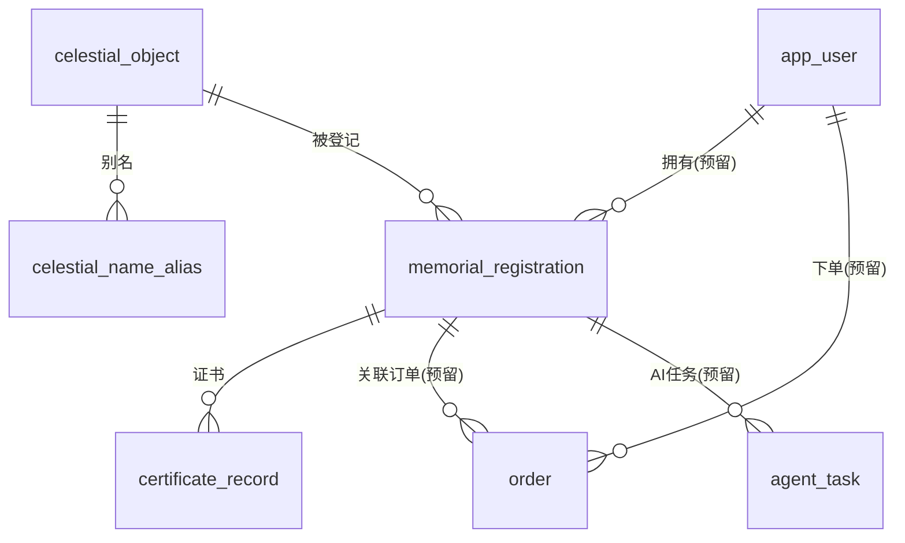

# 数据模型

> **定位**：库表**唯一事实来源**。`services/api/prisma/schema.prisma` 的每个 model 在本文有对应章节；
> 星表扩容规划（60 颗 → ~5000 亮星 + 命名候选池）全文在第 8 章。
> **读者**：后端工程师、数据工程师。
> **最后更新**：2026-07-10（Phase 2）。
> **关联文档**：[系统架构](./architecture.md) · [API 规范](./api-spec.md) · [部署运维](./deployment.md)

---

## 1. 建模原则

### 1.1 命名约定

- Prisma model 名 **PascalCase**（`CelestialObject`），表名 **snake_case**（`@@map("celestial_object")`）。
- 字段名 **camelCase**；本期**列名保持 camelCase**（不逐字段 `@map` 成 snake_case），
  减少映射心智负担——Prisma 是唯一 SQL 入口，人工手写 SQL 场景极少。
- 枚举 DB 侧用大写（`STAR` / `ACTIVE`），与共享包小写字面量（`'star'`）的映射由服务层完成。

### 1.2 主键策略

- 目录类表（`celestial_object` / `celestial_name_alias`）：内部自增 `Int` 主键 + 对外稳定业务标识
  `objectUid`（唯一，如 `HIP32349`）。外键一律引用 `objectUid` 而非自增 id，保证跨环境/重导入稳定。
- 业务类表（登记/用户/订单等）：`cuid()` 字符串主键 + 对外业务编号
  （`registrationNo` / `publicSlug` / `orderNo`，均 `@unique`）。对外接口**永不**暴露内部主键。

### 1.3 审计与软删除

- 所有表统一 `createdAt @default(now())` / `updatedAt @updatedAt`。
- 本期**不做软删除**（无 `deletedAt`）：登记的下线用状态机（`RegistrationStatus.REJECTED`）表达，
  目录数据的下架用 `isNamable=false` 表达；物理删除仅限运营后台未来引入时再评估。

## 2. ER 总览



枚举：`CelestialType`（STAR/GALAXY/NEBULA/CLUSTER）、`RegistrationStatus`（PENDING_REVIEW/ACTIVE/REJECTED）、
`OccasionType`（LOVE/BIRTHDAY/WEDDING/GRADUATION/NEWBORN/PET_MEMORIAL/IN_MEMORIAM/OTHER）、
`CertificateStatus`（PENDING/GENERATING/READY/FAILED）、`OrderStatus`（CREATED/PAID/CANCELLED/REFUNDED）、
`AgentTaskStatus`（QUEUED/RUNNING/SUCCEEDED/FAILED）。

## 3. celestial_object 天体主表

### 3.1 字段表（与 `packages/astro-data/src/types.ts` 的 `CelestialObject` 对照）

| 字段 | 类型 | 共享包对应 | 说明 |
| --- | --- | --- | --- |
| `id` | `Int` 自增 | —（服务端扩展） | 内部主键，不对外 |
| `objectUid` | `String @unique` | `objectUid` | 稳定唯一标识，如 `HIP32349` |
| `type` | `CelestialType` 枚举 | `type`（小写字面量） | DB 大写枚举 ↔ 共享包 `'star' \| 'galaxy' \| 'nebula' \| 'cluster'` |
| `nameEn` / `nameZh` | `String` | 同名 | 中英文主名 |
| `aliases` | `String[] @default([])` | `aliases` | 别名**快照**；搜索用规范化版本在 `celestial_name_alias` |
| `bayer` | `String?` | `bayer?` | 拜耳/佛兰斯蒂德命名，如 `α CMa` |
| `constellation` / `constellationZh` | `String` | 同名 | 星座中英文 |
| `raDeg` / `decDeg` | `Float` | 同名 | J2000 赤经 [0,360) / 赤纬 [-90,90]，单位度 |
| `magnitude` | `Float` | `magnitude` | 视星等（越小越亮） |
| `distanceLy` | `Float?` | `distanceLy: number \| null` | 距离（光年），未知为 null |
| `spectralType` | `String?` | `spectralType?` | 光谱型，如 `A1V` |
| `catalogIds` | `Json @default("{}")` | `catalogIds: Record<string,string>` | 各星表交叉编号，如 `{"hip":"32349","hd":"48915"}` |
| `isNamable` | `Boolean @default(true)` | `isNamable` | 是否可作纪念命名对象（策略见 §8.4） |
| `isFeatured` | `Boolean @default(false)` | `isFeatured` | 精选/著名星（首页展示、搜索优先） |
| `descriptionZh` | `String?` | `descriptionZh?` | 中文简介 |
| `renderPriority` | `Int @default(0)` | —（服务端扩展） | 前端渲染优先级/分包档位，运营可调（见 §8.3） |
| `searchPriority` | `Int @default(0)` | —（服务端扩展） | 搜索加权，DB 化后作 ORDER BY 次键 |
| `dataQualityScore` | `Int @default(0)` | —（服务端扩展） | 数据质量评分 0–100（坐标/星等/简介完整度） |
| `sourceCatalog` | `String @default("astro-data-seed-v1")` | —（服务端扩展） | 数据来源批次，如 `hyg-v3-import`，可重放可对账 |
| `createdAt` / `updatedAt` | `DateTime` | —（服务端扩展） | 审计字段 |

**类型选择理由**：

- `catalogIds` 用 `Json`（Postgres `jsonb`）——星表种类开放（hip/hd/hr/gl/…），逐来源建列不可维护；
  jsonb 支持 `catalogIds->>'hip'` 表达式查询，够用。
- `aliases` 用 `String[]`（Postgres `text[]`）——只是展示快照；**搜索不走这列**，
  走 `celestial_name_alias`（一行一别名，可建 GIN/pg_trgm 索引、带 lang/source 元数据）。

### 3.2 索引设计

| 索引 | 用途 |
| --- | --- |
| `objectUid @unique` | 详情查询、外键引用 |
| `@@index([isFeatured, magnitude])` | 精选列表、按亮度分层拉取 |
| `@@index([constellation])` | 按星座筛选 |
| `@@index([isNamable, searchPriority(sort: Desc)])` | 命名候选池抽样 + 搜索排序次键 |
| （Phase 3）`celestial_name_alias.aliasNorm` 上 pg_trgm GIN | DB 化模糊搜索，见 §6.2 |

## 4. memorial_registration 纪念登记表

| 字段 | 类型 | 说明 |
| --- | --- | --- |
| `id` | `String @id cuid()` | 内部主键 |
| `registrationNo` | `String @unique` | 对外纪念编号 `STAR-YYYYMMDD-XXXX`（生成规则见下） |
| `starObjectUid` | `String` FK → `celestial_object.objectUid` | 被登记星体 |
| `starSnapshotJson` | `Json` | **登记时刻的星体快照**（nameZh/nameEn/raDeg/decDeg/constellationZh/magnitude 等）；证书与纪念页以此为准，不受星表后续修订影响 |
| `memorialName` | `String @db.VarChar(64)` | 纪念名，1–40 个字符（按 **Unicode 码点**计，emoji 算 1 字；列宽 64 兜 UTF-16 余量） |
| `occasionType` | `OccasionType` 枚举 | 纪念场景。**DB 存英文枚举码**，中文标签是展示层映射（见 [api-spec.md §3.1](./api-spec.md)），文案调整不污染数据 |
| `memorialDate` | `DateTime? @db.Date` | 纪念日期（仅日期，无时区语义） |
| `blessingText` | `String? @db.VarChar(280)` | 想说的话，≤140 字符 |
| `storyText` | `String? @db.Text` | 长篇故事（纪念页预留），≤2000 字符 |
| `status` | `RegistrationStatus @default(ACTIVE)` | `PENDING_REVIEW`（命中复审词）/ `ACTIVE`（公开纪念页可访问）/ `REJECTED` |
| `publicSlug` | `String @unique` | 公开纪念页短链 slug（12 位小写去混淆字母表 ≈ 59 bit 熵，不可枚举） |
| `ownerUserId` | `String?` FK → `app_user.id` | 预留：本期匿名登记，恒为 null |
| `contactEmail` | `String?` | **隐私字段，任何对外接口不返回** |
| `reviewNote` | `String?` | 审核备注（内部字段） |
| `createdAt` / `updatedAt` | `DateTime` | 审计 |

索引：`@@index([starObjectUid, status])`（星体占用查询）、`@@index([ownerUserId])`、
`@@index([status, createdAt(sort: Desc)])`（后台审核列表）。

**registrationNo 生成规则**（`services/api/src/common/ids/registration-no.ts`）：

- 格式 `STAR-YYYYMMDD-XXXX`，后缀取自 31 字符去混淆字母表（排除 `0/O/1/I/L`），
  4 位 ≈ 92 万组合/天。
- 用 `node:crypto.randomInt`（CSPRNG）而非 `Math.random`；唯一性最终由 DB `@unique` 兜底，
  冲突时上层重试。
- 前端 `MemorialModal` 原本的本地 `makeRegistrationNo()` **已废弃**，仅保留同格式的
  `makeDemoRegistrationNo()`（`apps/web/src/lib/api.ts`）作后端不可达时的演示回退，
  演示编号不落库、UI 明确标注「演示模式」。

**与 celestial_object 的占用关系**：本期同一颗星**允许多条登记**（未建部分唯一索引）。
Phase 3 落地扩容后的「独占型命名」时，按 §8.4 第 3 条补：
`namingStatus` 字段 + `memorial_registration(starObjectUid)` 上 `WHERE status = 'ACTIVE'`
的部分唯一索引（partial unique index），并发下重复占用由约束拒绝、API 返回业务冲突码。

## 5. certificate_record 证书记录表（Phase 3 启用）

| 字段 | 类型 | 说明 |
| --- | --- | --- |
| `id` | `String @id cuid()` | 主键 |
| `registrationId` | FK → `memorial_registration.id`，`onDelete: Cascade` | 所属登记 |
| `status` | `CertificateStatus @default(PENDING)` | PENDING → GENERATING → READY / FAILED，与 BullMQ 任务状态机对齐 |
| `ossObjectKey` | `String?` | 阿里云 OSS 对象 key，如 `certificates/2026/07/STAR-20260710-K7PX-v1.pdf` |
| `templateVersion` | `String @default("v1")` | 模板版本，证书模板迭代后可重出 |
| `error` | `String?` | 失败原因 |

索引：`@@index([registrationId, status])`。本期只建表不消费；worker 由 Phase 3 的 BullMQ 补齐。

### 5.1 其余占位表

- **`app_user`**：用户占位（微信 openid/unionid、email、phone 均可空且唯一；`role` 存字符串不做 RBAC）。
  本期不做鉴权，只保证外键落点存在。
- **`order`**：订单占位（`orderNo` 唯一、`amountFen` 以**分**计避免浮点、`skuCode`、支付渠道预留）。
- **`agent_task`**：AI 技能任务持久化载体（`skillCode` 如 `certificate.copywriting`、
  `inputJson/outputJson`、`attempts` 与 BullMQ 重试对齐）。

## 6. 搜索的 DB 化路径

### 6.1 Phase 2：内存目录（现状）

`CelestialService`（`services/api/src/celestial/celestial.service.ts`）直接调用
`@star/astro-data` 的 `searchCelestial(q, { limit, catalog })`——与前端**同一份**打分代码：
按字段家族（name/alias/bayer/catalog/constellation）加权匹配质量，叠加亮度加成
`brightnessBonus(magnitude)`，降序截断 limit。5000 条内存打分毫秒级，扩容不阻塞后端。

### 6.2 Phase 3：pg_trgm + tsvector

数据基础已就位：**`celestial_name_alias` 别名表**（一行一别名）。

| 字段 | 说明 |
| --- | --- |
| `objectUid` | FK → `celestial_object.objectUid`，`onDelete: Cascade` |
| `alias` | 别名原文，如 `天狼星` / `Dog Star` / `α CMa` |
| `aliasNorm` | 规范化别名（小写、trim、NFD 去拉丁变音），**规范化逻辑与 `packages/astro-data/src/search.ts` 的 normalize 保持一致** |
| `lang` | `'zh' \| 'en' \| 'sci'` |
| `source` | `'name' \| 'alias' \| 'bayer' \| 'catalog' \| 'constellation'`，与 `StarSearchResult.matchedOn` 对齐 |

约束：`@@unique([objectUid, aliasNorm, source])`、`@@index([aliasNorm])`。

切换步骤：

```sql
-- 1. 启用扩展（superuser，一次性）
CREATE EXTENSION IF NOT EXISTS pg_trgm;
-- 2. 建 GIN 索引
CREATE INDEX celestial_name_alias_norm_trgm
  ON celestial_name_alias USING gin ("aliasNorm" gin_trgm_ops);
-- 3. 查询形态（示意）：相似度打分 + searchPriority 次键
SELECT o.*, similarity(a."aliasNorm", $1) AS sim, a.source AS matched_on
FROM celestial_name_alias a
JOIN celestial_object o ON o."objectUid" = a."objectUid"
WHERE a."aliasNorm" % $1
ORDER BY sim DESC, o."searchPriority" DESC, o.magnitude ASC
LIMIT $2;
```

**打分等价性对照**（保证内存版与 DB 版排序观感一致）：

| 内存版（search.ts） | DB 版 |
| --- | --- |
| 前缀/包含/全等的匹配质量分档 | `similarity()`（trigram 相似度）近似 |
| 字段家族权重（name > alias > bayer > catalog > constellation） | `source` 加权系数（应用层或 SQL CASE） |
| `brightnessBonus(magnitude)` | `searchPriority`（seed/ETL 时按同公式预计算落库） |
| `matchedOn` 字段 | `a.source` 透出 |

切换动作只发生在 `CelestialService` 一个类内（注入 PrismaService、替换 search/getByUid 实现），
控制器与 DTO 不动；建议加环境开关 `SEARCH_BACKEND=memory|pg` 灰度。

## 7. seed 策略

- `services/api/prisma/seed.ts`（`pnpm --filter @star/api db:seed` = `prisma db seed`，tsx 执行）：
  把 `@star/astro-data` 的 `CELESTIAL_CATALOG`（60 颗）写入 `celestial_object`，
  并为每颗星展开写 `celestial_name_alias`（nameZh/nameEn/aliases/bayer/catalogIds/constellation
  各来源一行，`aliasNorm` 用与 search.ts 一致的规范化）。幂等：按 `objectUid` upsert。
- seed 是**登记外键的前置条件**：`memorial_registration.starObjectUid` 引用主表，
  真实环境必须先 migrate + seed 再开放登记。
- 与扩容 ETL 的关系：seed 只负责精选 60 颗（`sourceCatalog='astro-data-seed-v1'`）；
  ~5000 颗由第 8 章的 ETL 批量导入（`sourceCatalog='hyg'`），二者按 `objectUid` 合并去重、
  精选星以手工数据为准。

## 8. 扩容规划（60 颗 → ~5000 亮星 + 命名候选池）

> 本章为**规划**，Phase 2 不实现；ETL 落地在 Phase 3。

### 8.1 目标与分层

- 目标规模：**渲染层 ~5000 颗亮星**（约等于全天肉眼可见极限 mag ≤ 6.0–6.5 的恒星数，
  HYG 中 mag ≤ 6.0 约 5 千颗量级）+ **命名候选池**（从中筛出的可售子集）。
- 现有 60 颗精选星升级为「精选层」，**不删除、不改 objectUid**，扩容数据与之合并去重。
- 三层数据写入 `celestial_object` **同一张表**，用字段区分：

| 层 | 规模 | 判定 | 用途 |
| --- | --- | --- | --- |
| 精选层 featured | ~60–120 | `isFeatured=true`（现有 60 颗 + ETL 补充的著名星） | 首页展示、搜索置顶、讲故事素材 |
| 渲染层 render | ~5000 | `magnitude ≤ 6.5` | 星空渲染、搜索可达 |
| 命名池 namable | ~2000–3500 | 见 §8.4 | 可售命名候选 |

### 8.2 数据源与 ETL 路径

数据源定稿：**HYG Database v3**（`hygdata_v3.csv`，CC BY-SA 4.0，需在 docs 与页面
「数据来源」处署名）。已合并 Hipparcos/HD/Gliese/Bayer/Flamsteed/常用英文名，字段齐全
（ra/dec J2000、mag、dist(pc)、spect、proper、bayer、con、hip、hd、hr、gl）。

ETL 管道（一次性脚本，放 `packages/astro-data/etl/`，Node 22 + TS，除 DB 外零运行时服务依赖）：

```
HYG v3 CSV
  → ① 解析与筛选：mag ≤ 6.5；剔除太阳（id=0）；剔除无 hip 且无 hd 编号的孤儿行
  → ② 字段清洗与换算：
       ra(小时) × 15 → raDeg；dec → decDeg
       dist(pc) × 3.26156 → distanceLy（dist ≥ 100000 视为未知 → null）
       spect 截断规整；proper/bayer/flamsteed → nameEn/bayer/aliases
  → ③ objectUid 生成：优先 'HIP{hip}'，无 hip 用 'HD{hd}'，再无用 'HR{hr}'
       （与现有 60 颗的 HIPxxxx 约定一致）
  → ④ 中文名映射：人工映射表 zh-names.json（著名星中文名/星官名）；
       未命中的 nameZh 用「{星座中文名}{bayer 希腊字母中文序}」，
       或退化为 nameEn 音译占位 + 标记 needsZhReview
  → ⑤ 星座中英映射复用 packages/astro-data/src/constellations.ts
  → ⑥ 与现有 60 颗 CELESTIAL_CATALOG 按 objectUid 合并：
       精选星以手工数据为准（descriptionZh 等人工字段保留），仅回填缺失字段
  → ⑦ 计算 renderPriority / searchPriority / isNamable / isFeatured（见 §8.3 / §8.4）
  → ⑧ 校验：raDeg∈[0,360)、decDeg∈[-90,90]、objectUid 唯一、
       mag 分布抽样比对权威值（如天狼星 -1.46）
  → ⑨ 产出双格式：
       a) catalog-5k.json —— 供前端分层静态加载与 astro-data 内存目录
       b) prisma seed / 批量导入用 NDJSON → celestial_object
          （createMany 分批 1000 条/批，冲突按 objectUid skip/update）
```

导入 DB 的批量策略：真实环境用 `prisma.$transaction` 分批 `createMany`；5000 条属小表，
无需 COPY，但 >10 万行时升级为 `\copy` 路径。ETL 输出带 `sourceCatalog='hyg'` +
`sourceVersion='v3.x'`（本期 schema 用 `sourceCatalog` 字符串承载批次，如 `hyg-v3.x`），
保证可重放、可对账。

### 8.3 renderPriority / searchPriority 设计

- **`renderPriority`**：按视星等分档，用于前端分包渐进加载与 LOD（细节层次）——

  | 档 | 判定 | 规模 | 用途 |
  | --- | --- | --- | --- |
  | 0 | `isFeatured` | ~60–120 | 首屏必载 |
  | 1 | `mag ≤ 2.5` | ~90 | 骨架星空 |
  | 2 | `mag ≤ 4.5` | ~900 | 交互稳定后流式补载 |
  | 3 | `mag ≤ 6.5` | 其余 | 同上 |

  前端首屏只加载 0–1 档，交互稳定后流式补 2–3 档（对应 [architecture.md §5.1](./architecture.md)
  的 InstancedMesh 改造）。
- **`searchPriority`**：搜索同分排序因子 = isFeatured 加成 + 亮度加成（沿用内存版
  `brightnessBonus` 公式预计算落库），DB 化后作 `ORDER BY` 次键，保证内存版与 DB 版排序一致（§6.2）。

> 注：规划中的档位语义为「0 最高、数值越小越优先」；现 schema 默认值 `0` 与
> 「运营可调、大者更醒目」的注释以 ETL 落地时统一为准，届时同步修订本表与 schema 注释。

### 8.4 isNamable / isFeatured 策略（定稿）

**核心决策：著名星保留展示、不进入命名池；命名池取 4.0 ≤ mag ≤ 6.5 的非著名星。**

1. `isFeatured=true`（现有 60 颗及 ETL 补充的有 proper name 的著名星）→ **`isNamable=false`**。理由：
   - **合规与体验**：把「天狼星」卖给个人会强化「买断知名星星」的误导观感，与「不宣传官方命名」红线冲突；
   - **商业**：著名星是流量与内容素材（展示、讲解、可见性演示），公共展示价值大于单次售卖；
   - **供给**：mag 4.0–6.5 的非著名星有数千颗，肉眼/双筒可见、有真实 HIP 坐标编号，
     「一颗真实可指认但尚无俗名的星」正是产品叙事的最佳载体。
2. 命名池准入：`4.0 ≤ mag ≤ 6.5` 且 `isFeatured=false` 且有 HIP 编号，
   且非著名变星/密近双星干扰项（ETL 维护小型排除表）。约 2000–3500 颗。
3. **独占语义**：命名池内每颗星**同时仅允许一条生效登记**——
   `celestial_object` 增加 `namingStatus: available/reserved/registered`；
   `memorial_registration(starObjectUid)` 上 `WHERE status='ACTIVE'` 的部分唯一索引。
   独占是礼品价值感的来源；池子足够大，不构成供给瓶颈。（本期未建，见 §4「占用关系」。）
4. `mag < 4.0` 的非著名星（约几百颗）：默认 `isNamable=false` 作「高端池」预留，
   未来可作溢价 SKU，本期只留字段不开放。
5. 所有可命名接口响应必须携带合规声明字段（联动 [api-spec.md §1.5](./api-spec.md)）。

### 8.5 与现有代码的衔接

- `CelestialObject` 类型（`packages/astro-data/src/types.ts`）新增
  `renderPriority` / `searchPriority` / `namingStatus` 时一律**可选字段**，
  保持向后兼容，前端现有 60 颗数据不破坏。
- Phase 2 搜索仍走 astro-data 内存目录（5000 条内存打分毫秒级）；DB 化按 §6 路径执行，
  扩容不阻塞后端开发。
- 前端 R3F 渲染 5000 点位需改 InstancedMesh/BufferGeometry 单 draw call——
  已在 [architecture.md §5.1](./architecture.md) 标注为前端后续工作项，不属本文档范围。

### 8.6 风险与开放问题

- **中文名覆盖率**：HYG 无中文名，人工映射表初期只覆盖著名星；未审校星体在 UI 上以
  「星座 + 编号」展示，避免机器音译劣质体验。
- **许可**：HYG v3 为 CC BY-SA，需在关于页/文档署名；若未来商业上不接受 SA 传染性，
  评估切换 Hipparcos 原始目录（公开数据）重建管道——ETL 分层设计已为换源留口。
- **双星/变星体验**（亮度变化、伴星）：排除表初版从 GCVS 高幅变星简表人工挑选，标注为迭代项。

## 9. 迁移与版本管理

- 迁移工具：`prisma migrate`。迁移文件随仓库提交（`services/api/prisma/migrations/`）。
- **本地开发容器（无 PG）只跑 `prisma generate`**——生成 Client 供 typecheck/build/单测，
  不做 migrate（硬性约束）。首次迁移由有 DB 的环境执行 `prisma migrate dev --name init` 生成。
- 真实环境：`pnpm --filter @star/api db:migrate`（= `prisma migrate deploy`，只应用不生成）
  → `pnpm --filter @star/api db:seed`。完整 runbook 见 [deployment.md §5](./deployment.md)。
- schema 变更纪律：改 `schema.prisma` 必须同步更新本文档对应章节；破坏性迁移
  （删列/改类型）需在 PR 中说明数据回填方案。
